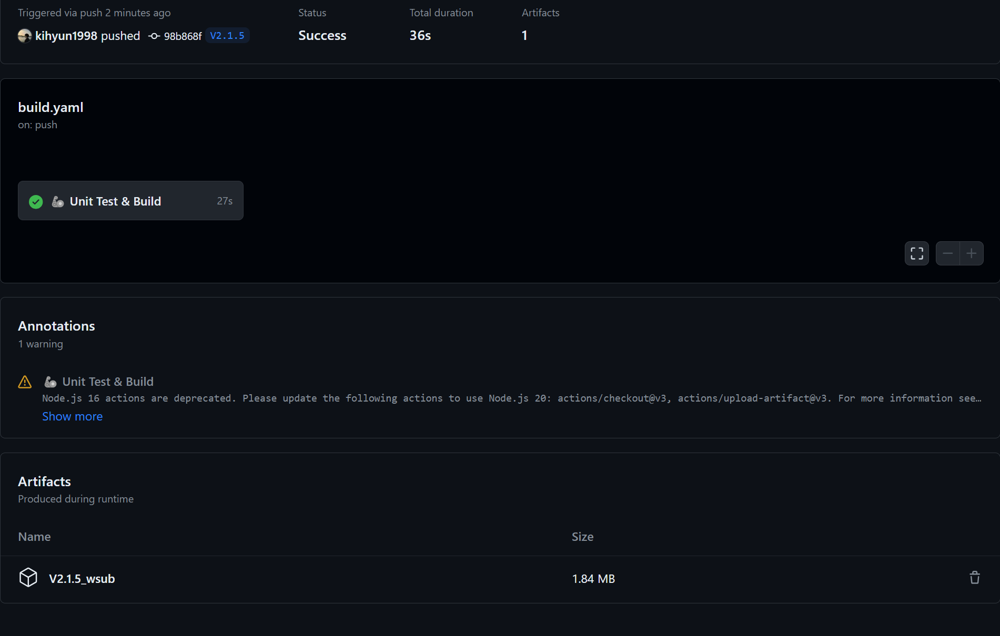

# [Github Actions] Github Action에서 artifacts사용
---

## artifacts
---

github actions에서 빌드한 파일은 어디로 가는가?

그걸 저장하기 위해서 artifacts에 저장할 수 있다.


```yaml
      - name: 💾 Save file in artifacts
        uses: actions/upload-artifact@v3
        with:
          name: ${{env.FILE_NAME}}
          path: ${{github.workspace}}/${{env.FILE_NAME}}
```

이렇게 하면 된다 !

무슨 외계어 같지만 이전 게시물을 참고하면된다.

`name`은 저장할 파일 이름 `path`는 파일이 있는 경로 `${{github.workspace}}`는 github에서 제공하는 workspace 경로 `${{env.FILE_NAME}}` 이거는 build해서 나온 파일 이름이다.

그럼 아래 사진처럼 `Artifacts`라는 탭이 생기면서 이것을 활용할 수 있게 된다.




## SMTP로 전송하기
---

```yaml
      - name: 📩 Send email
        if: success()
        uses: dawidd6/action-send-mail@v3
        with:
          server_address: smtp.gmail.com
          server_port: 465
          username: ${{ secrets.EMAIL_USERNAME }}
          password: ${{ secrets.EMAIL_PASSWORD }}
          subject: From Github Actions's build file
          body: Hi! This is artifacts of ${{github.repository}}.
          to: [받을 사람 이메일]
          from: ${{ secrets.EMAIL_USERNAME }}
          attachments: ${{github.workspace}}/${{env.FILE_NAME}}
```

if는 성공한다면 ! 이고 `dawidd6/action-send-mail@v3` 이 서비스를 사용해서 메일 전송할 수 있었습니다.

`server_address` : gmail smtp를 사용했습니다.
`server_port` : 서버 포트
`username`과 `password`는 구글 메일 비번이 아닌 앱 비밀번호라는건데 이건 따로 smtp 설정하는 법 검색하면 됩니다.

github secret에 메일 id와 password를 저장했습니다.


`subject` : 메일 제목
`body` : 메일 내용
`to` : 받을 사람 메일
`from` : 보낼 사람 메일
`attachments` : 첨부파일의 경로