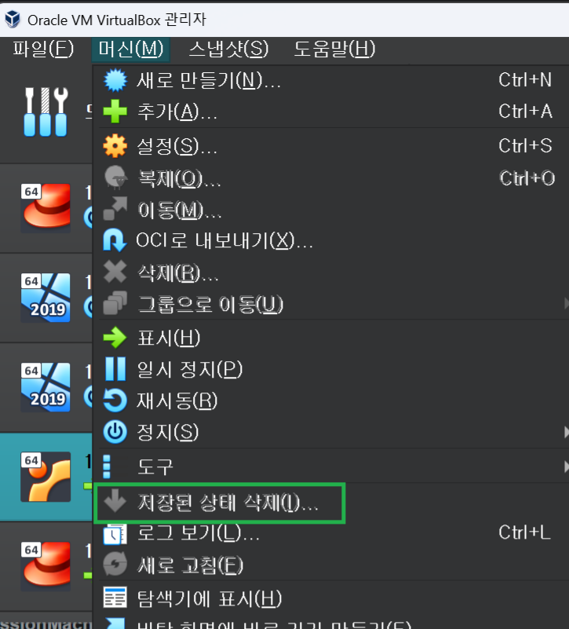

# Virtual Box 에러 해결
---

스냅샷 찍은 환경으로 돌아가는 과정에서 아래와 같은 에러 메시지가 발생했다.

:::warning
The VM session was aborted.  
결과 코드: E_FAIL (0X80004005)  
구성 요소: SessionMachine   
인터페이스: ISession {c0447716-ff5a-4795-b57a-ecd5fffa18a4}
:::

멘붕이 왔지만 해결방법을 찾았다.

`머신` > `저장된 상태 삭제`를 해주면 된다.

