# 1. [etc] Inno Setup 사용하기
---

[inno setup download link](https://jrsoftware.org/isdl.php)에 들어가서 다운로드 할 수 있다.

## 시작하기
---

1. Create a new script file using the Script Wizard 클릭 후 ok

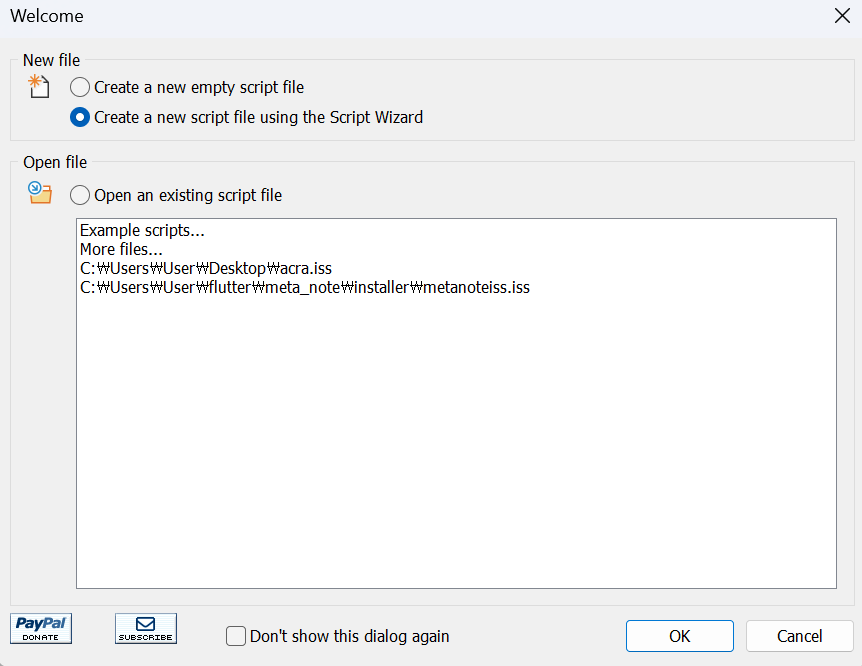

2. Next

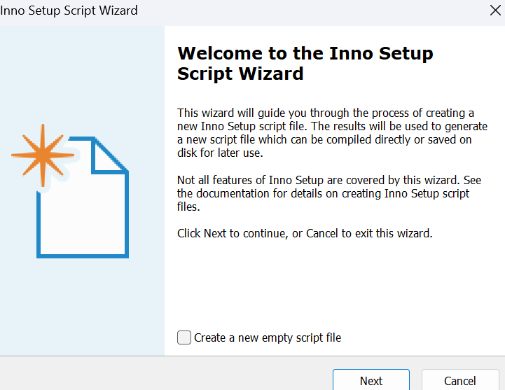

3. 어플리케이션 이름과 버전 등.. 명시

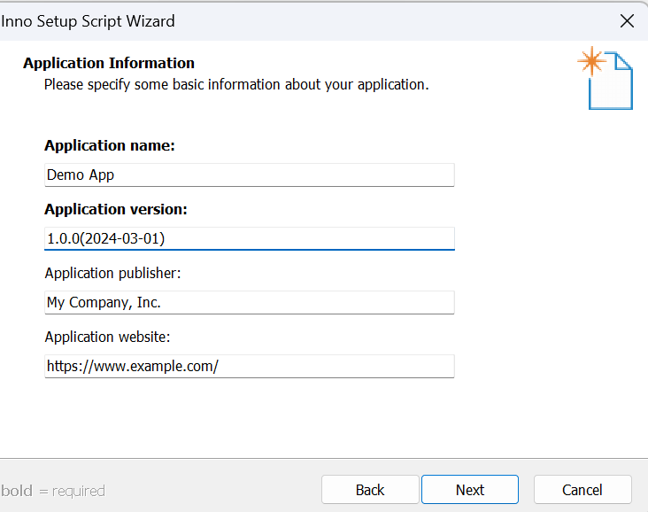

4. 설치 폴더 지정 ( custom도 가능 )

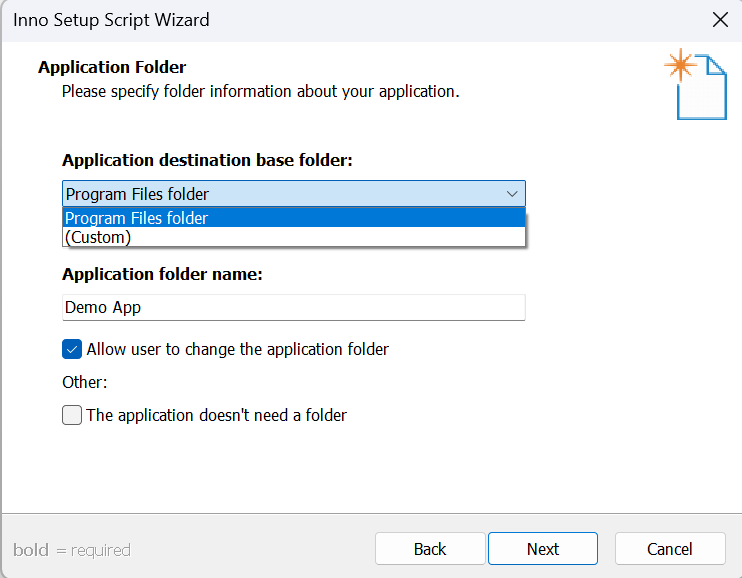

5. `Application main executable file` 설정하여 로컬에서 실행파일 가져오기

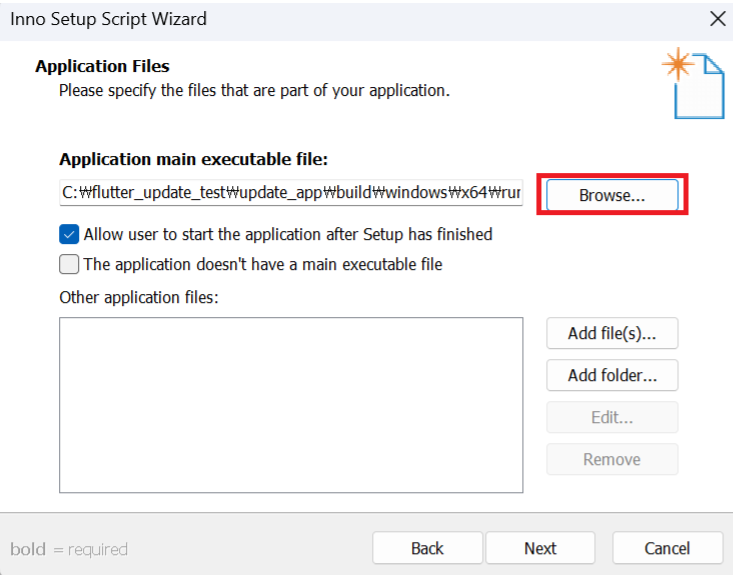

6. `Add files` ( 사용해야할 dll 등 )

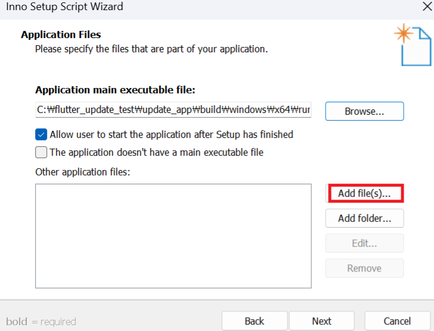

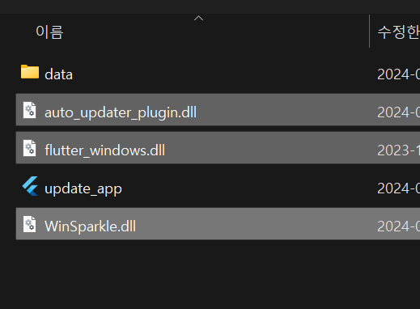

7. `Add folders` ( 사용해야할 asset 등 )

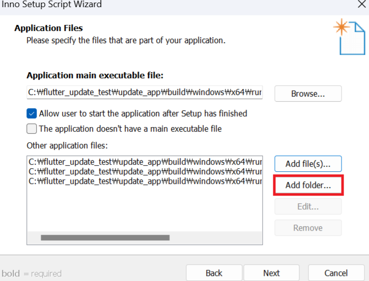

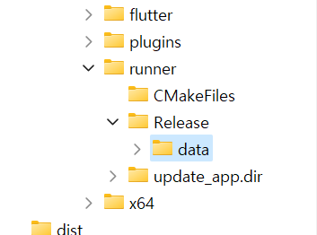

8. destination subfolder 설정

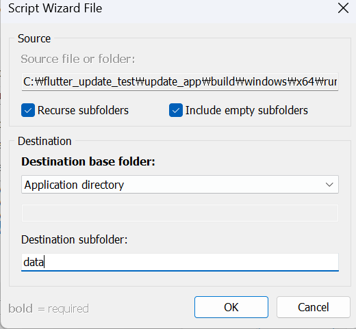

9. Associate a file type to the main executable 해제

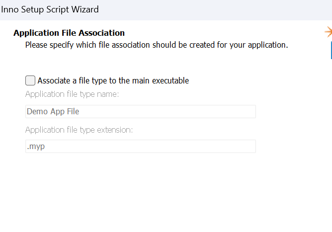

10. Next

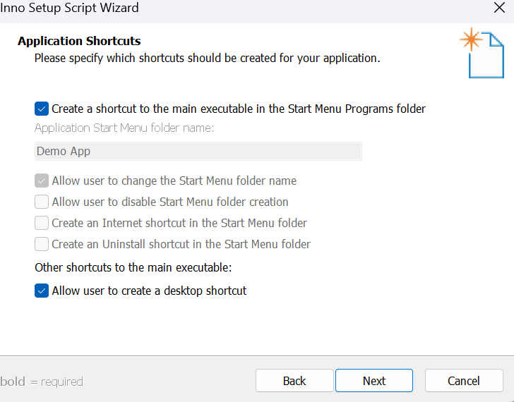

11. 라이센스 파일 등 넣기

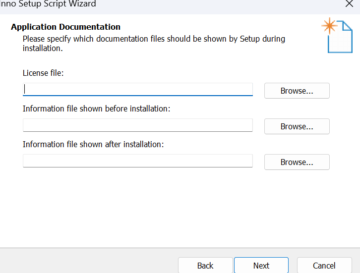

12. 설치권한 설정

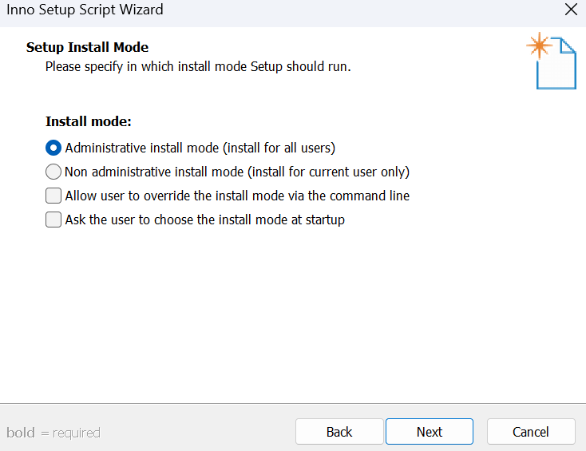

13. 언어 설정

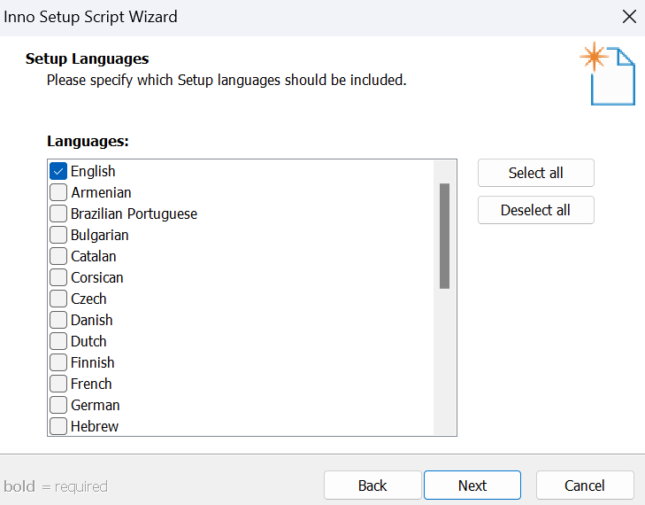

14. 설치파일 폴더/파일 이름/아이콘/비밀번호 설정

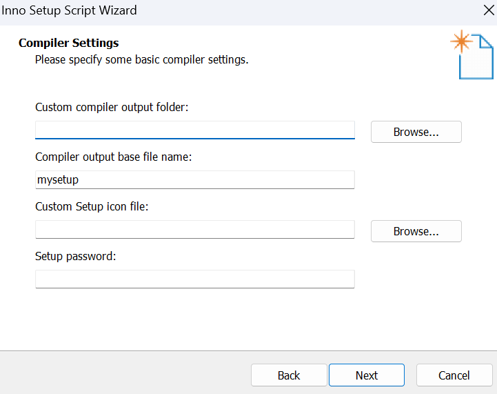

15. yes yes ( iss 파일 저장하는거임 )

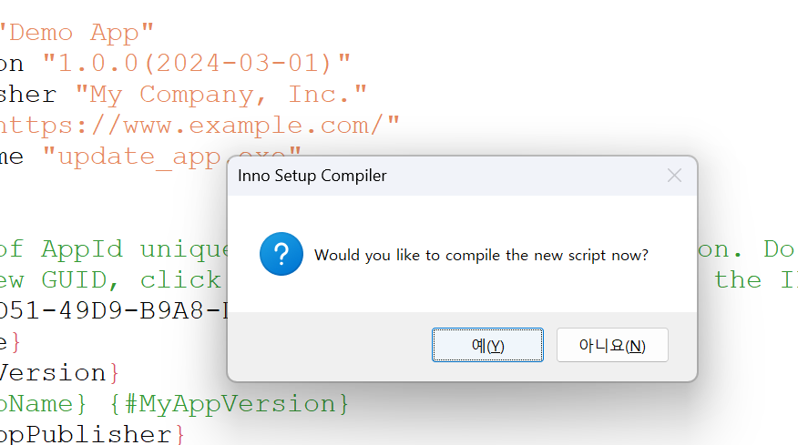

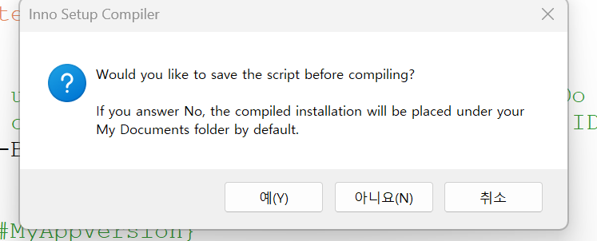

