#  10. [etc] Windows에서 Macos 사용하기
---

## 사전 준비
---

### 1. 코어 격리

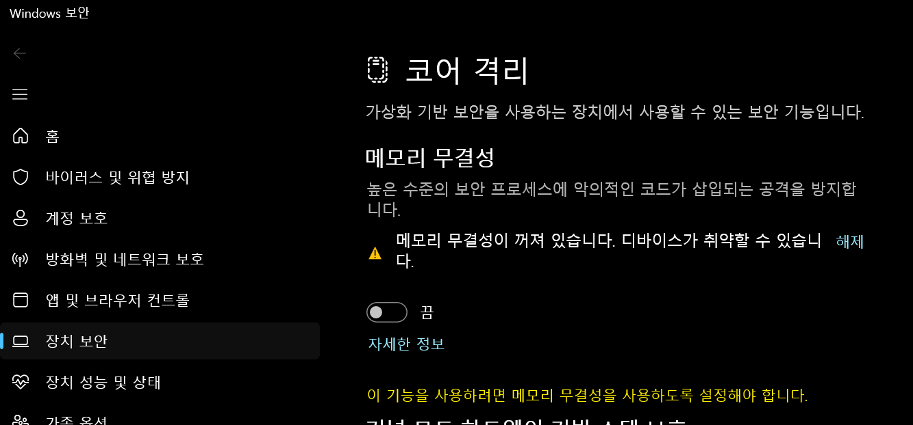


### 2. hyper-v 끄기

cmd를 관리자 권한으로 실행 후

```bash
bcdedit /set hypervisorlaunchtype off
```

```text
The operation completed successfully.
```

요래 나오면 성공. 그리고 컴퓨터 재시작해야한다.

### 3. virtualbox 다운로드

[VirtualBox 다운로드 링크](https://www.virtualbox.org/wiki/Downloads)로 가서 windows host로 다운로드 합니다.

### 4. macos iso 다운로드

[MacOS 다운로드 링크](https://archive.org/details/macos_iso)로 가서 macos iso를 다운로드 합니다.

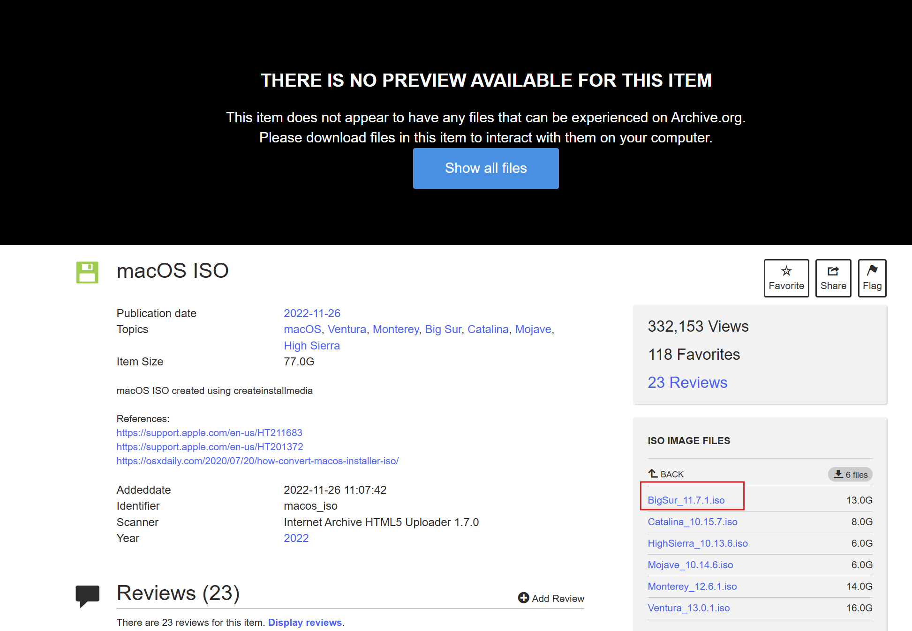

`BigSur`로 다운로드 했습니다.


## 만들기
---

### 1. 이미지 넣기

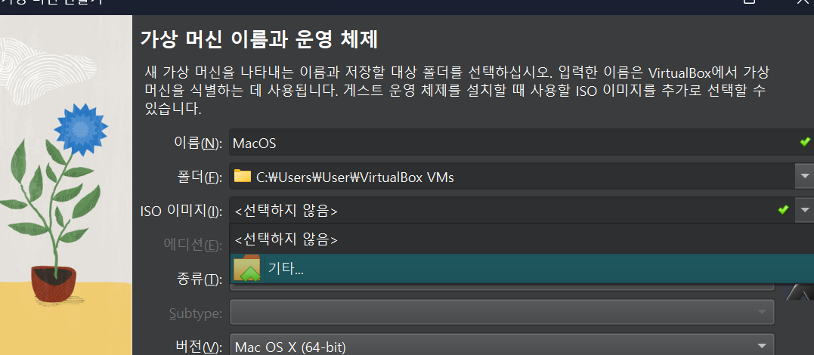

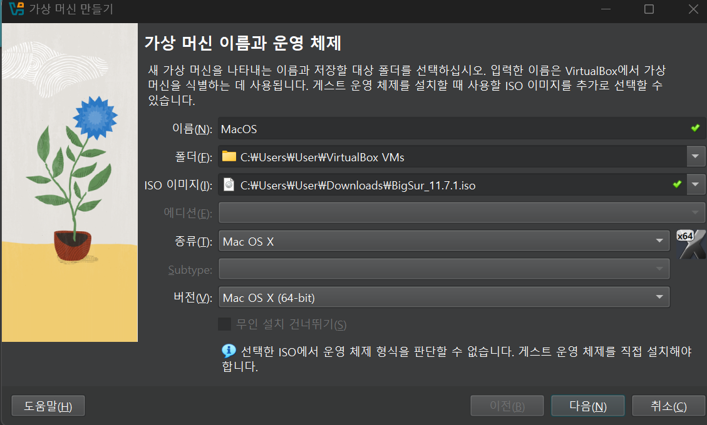

다운로드 받았던 iso 파일을 넣습니다.

타입은 `Mac OS X` 버전은 `Mac Os X (64-bit)` 로 정합니다. 


### 2. 설치 준비


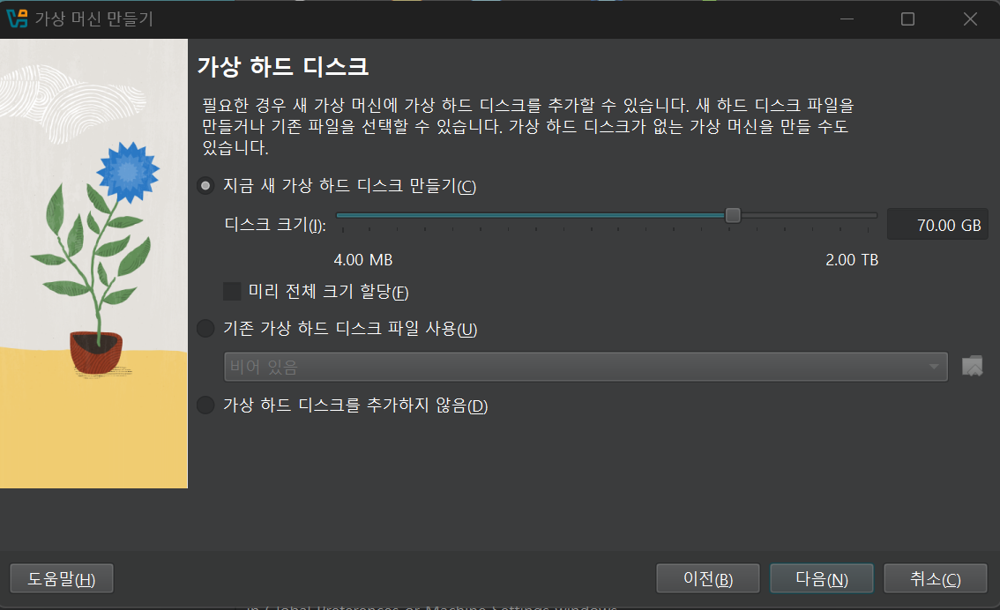


하드웨어 설정하고

### 3. 시스템 설정

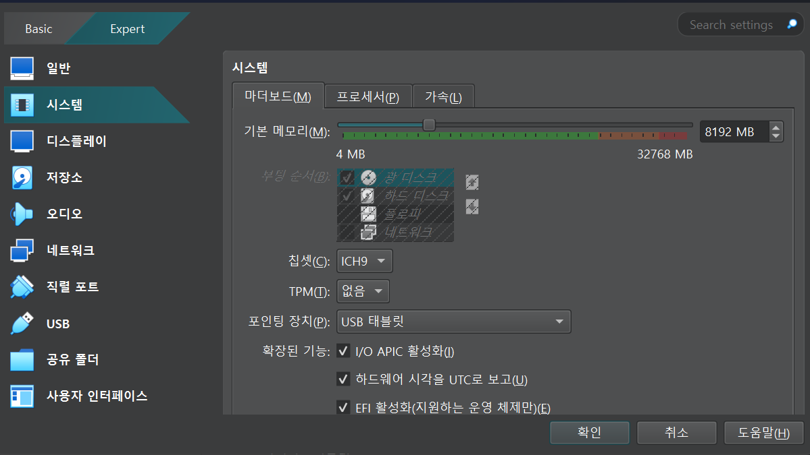

시스템 설정을 해야하는데 부팅 순서를 변경해야합니다.

EFI를 잠깐 비활성화 했다가 `플로피 uncheck`를 해주시고 다시 

`I/O...`, `하드웨어..`, `EFI..`를 활성화 시켜줍니다.

### 4. 네트워크 설정

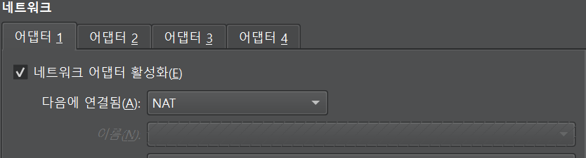

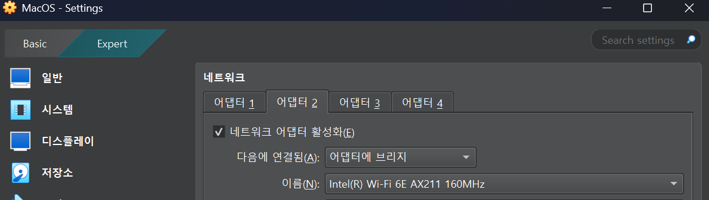


### 5. 디스플레이 설정

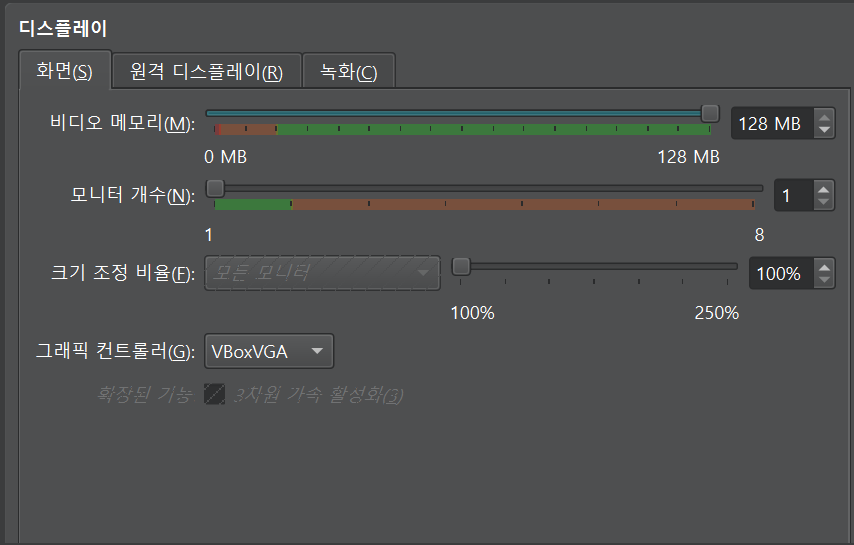


## 명령어 입력
---

cmd를 관리자 권한으로 실행하여 다음 명령어를 입력합니다.

intel cpu는 아래처럼 하면됩니다.

```bash
cd "C:\Program Files\Oracle\VirtualBox\"

VBoxManage.exe modifyvm "{VM 이름}" --cpuidset 00000001 000106e5 00100800 0098e3fd bfebfbff

VBoxManage setextradata "{VM 이름}" "VBoxInternal/Devices/efi/0/Config/DmiSystemProduct" "iMac19,3"

VBoxManage setextradata "{VM 이름}" "VBoxInternal/Devices/efi/0/Config/DmiSystemVersion" "1.0"

VBoxManage setextradata "{VM 이름}" "VBoxInternal/Devices/efi/0/Config/DmiBoardProduct" "Iloveapple"

VBoxManage setextradata "{VM 이름}" "VBoxInternal/Devices/smc/0/Config/DeviceKey" "ourhardworkbythesewordsguardedpleasedontsteal(c)AppleComputerInc"

VBoxManage setextradata "{VM 이름}" "VBoxInternal/Devices/smc/0/Config/GetKeyFromRealSMC" 0

VBoxManage setextradata "{VM 이름}" "VBoxInternal/TM/TSCMode" "RealTSCOffset"
```

```bash
cd "C:\Program Files\Oracle\VirtualBox\"

VBoxManage.exe modifyvm "{VM 이름}" --cpuidset 00000001 000106e5 00100800 0098e3fd bfebfbff

VBoxManage setextradata "{VM 이름}" "VBoxInternal/Devices/efi/0/Config/DmiSystemProduct" "iMac19,3"

VBoxManage setextradata "{VM 이름}" "VBoxInternal/Devices/efi/0/Config/DmiSystemVersion" "1.0"

VBoxManage setextradata "{VM 이름}" "VBoxInternal/Devices/efi/0/Config/DmiBoardProduct" "Iloveapple"

VBoxManage setextradata "{VM 이름}" "VBoxInternal/Devices/smc/0/Config/DeviceKey" "ourhardworkbythesewordsguardedpleasedontsteal(c)AppleComputerInc"

VBoxManage setextradata "{VM 이름}" "VBoxInternal/Devices/smc/0/Config/GetKeyFromRealSMC" 0

VBoxManage modifyvm "{VM 이름}" --cpu-profile "Intel Core i7-6700K"

VBoxManage setextradata "{VM 이름}" "VBoxInternal/TM/TSCMode" "RealTSCOffset"
```


## 시작
---

그리고 시작하기 누르면 됩니다.

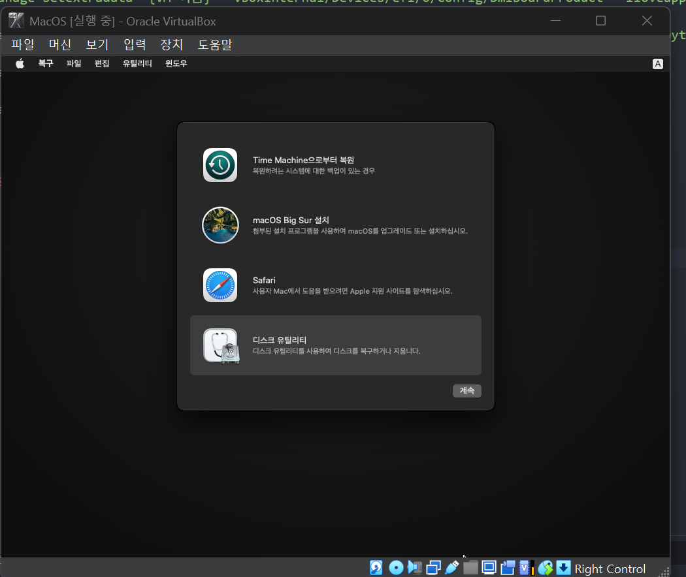

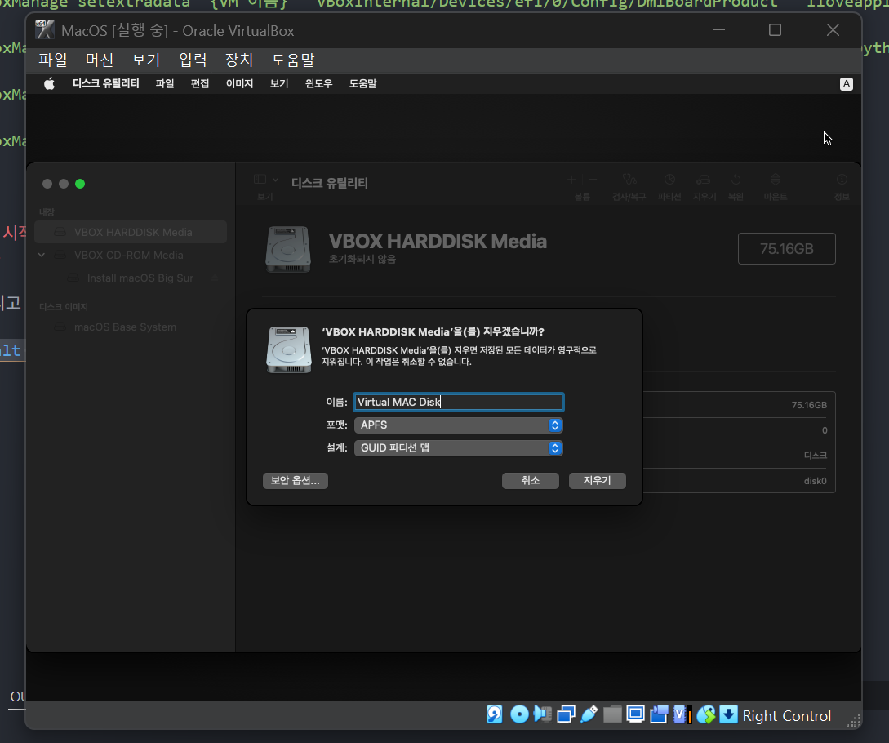

지웁니다. 다 지워지면 완료를 누르고 disk utility를 나옵니다.

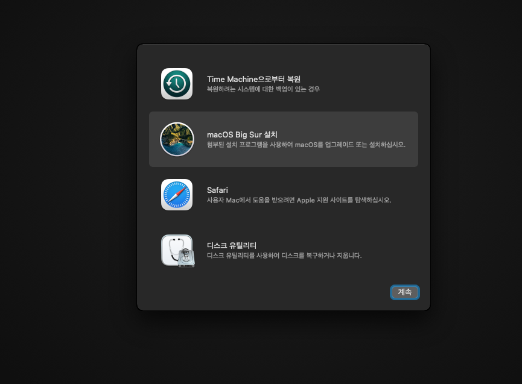

이걸 누르고 진행합니다.

...

설치가 진행된 후에

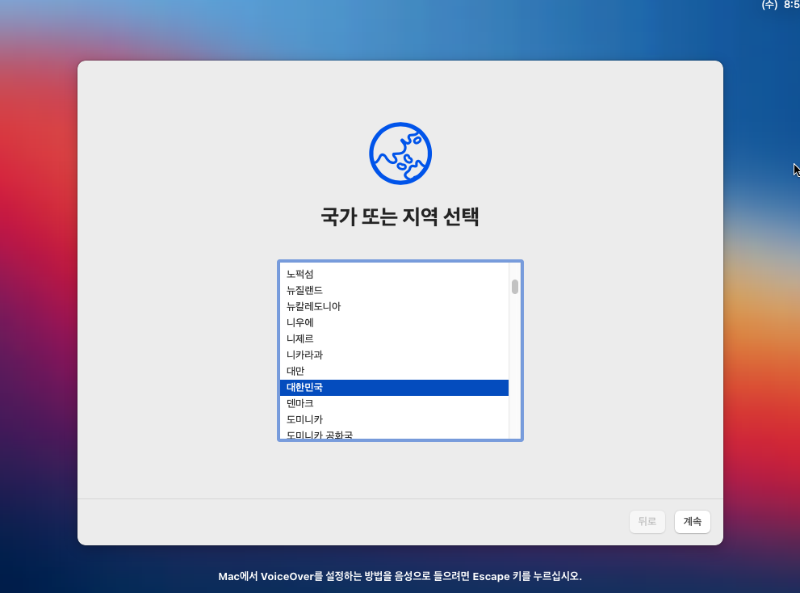

국가를 고르고

다 not now, set up later 를 하면 됩니다. 그럼 잘 됩니다.

## 화면 크기 키우기
---

vm을 종료하고

cmd를 관리자 권한으로 실행하고

```bash
cd "C:\Program Files\Oracle\VirtualBox\"

VBoxManage setextradata "{VM 이름}" VBoxInternal2/EfiGraphicsResolution 1920x1080
```

이렇게 할 수 있습니다.

### 해상도 정보

```text
Choose a Resolution:
  1280x720 | 1920x1080 | 2560x1440 | 2048x1080 | 3840x2160
    HD         FHD          QHD         2K          4K
```


