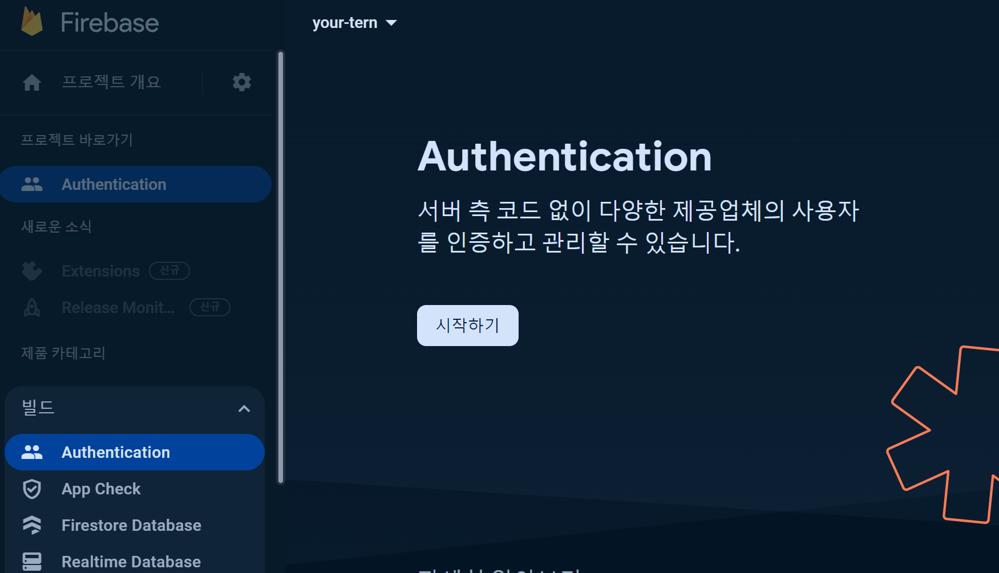
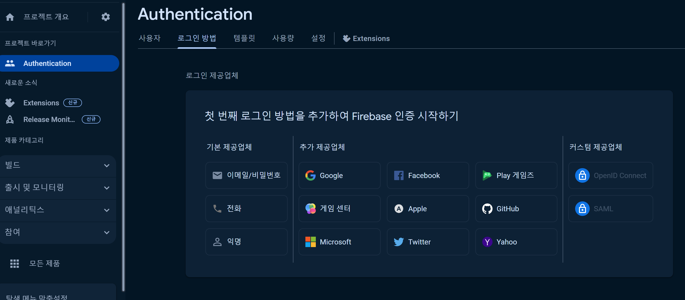
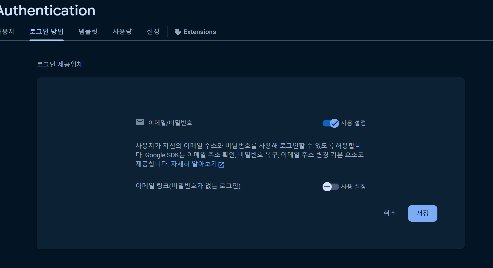

# 5. [etc] firebase 로그인
---

## 1. 패키지 get
---

```bash
flutter pub add firebase_auth
```

## 2. 코드
---

```dart
 onPressed: () async {
  await FirebaseAuth.instance.signInWithEmailAndPassword(
    email: idController.text.trim(),
    password: pwController.text.trim(),
  );
},
```

## 3. firebase setting
---



`firebase` > `해당 프로젝트` > `build` > `Authentication` 로 이동



`이메일/비밀번호` 클릭



활성화하고 저장


