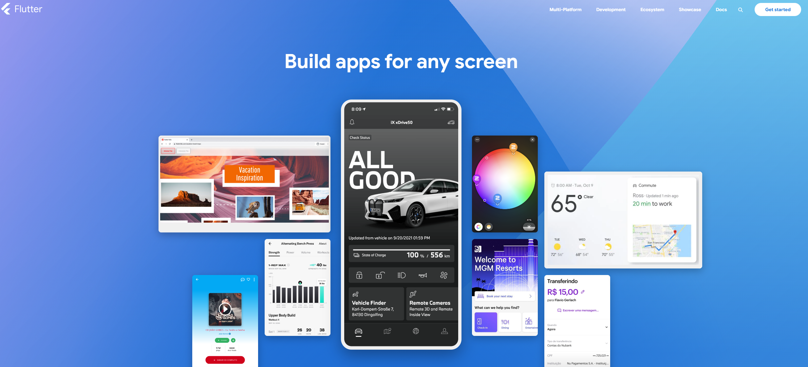
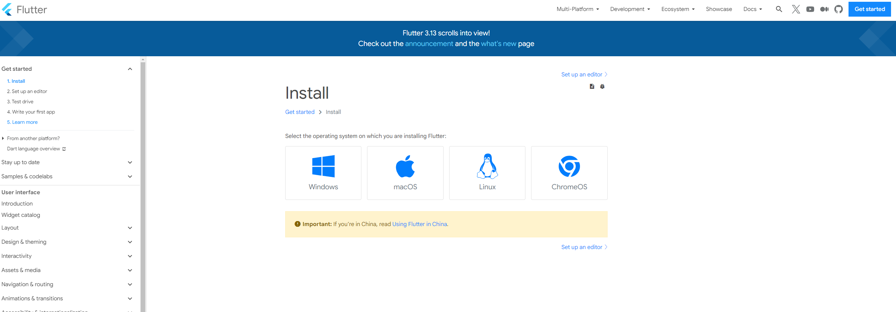
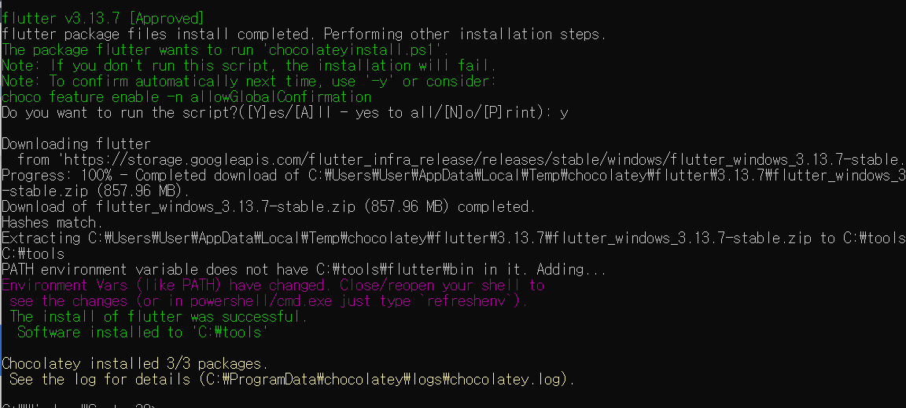
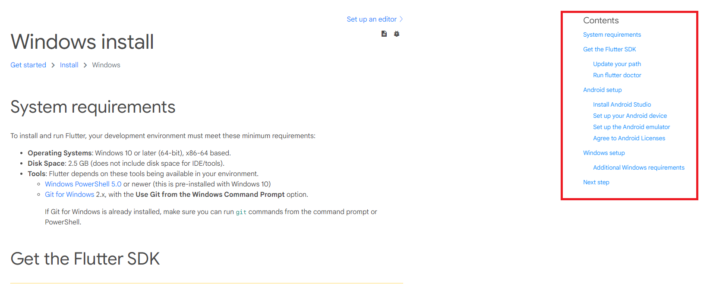

# 01. [Flutter] 설치하기

:::tip
1. [플러터 설치](#설치하기)
2. [시뮬레이터 설치](#시뮬레이터-설치)
:::


## 사전 준비 사항
---

아래 링크로 이동합니다.

[플러터 페이지](https://flutter.dev/)

그리고 우측 상단 Get started를 누릅니다.




그럼 아래와 같은 페이지로 이동됩니다.



그냥 [여기](https://docs.flutter.dev/get-started/install)로 이동하셔도 됩니다.


근데 여기서 다운로드 하지 않고 쉬운 방법이 있음.

choco를 사용하는건데 [여기](https://chocolatey.org/install)에서 다운로드 받아서 사용할 수 있다.


## 설치하기

```bash title='bash'
choco install flutter
```

MAC 유저면 `homebrew`로 설치하기




설치 끝!!!

## 시뮬레이터 설치

[여기 들어가서](https://docs.flutter.dev/get-started/install/windows) 따라하기 !!



저기서 `Android setup` 또는 `Window setup` 하면 끝! 