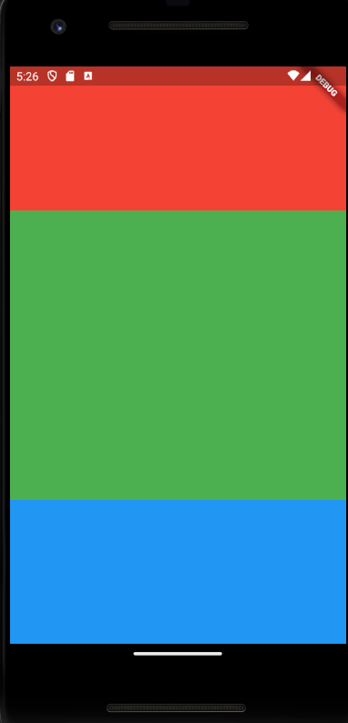
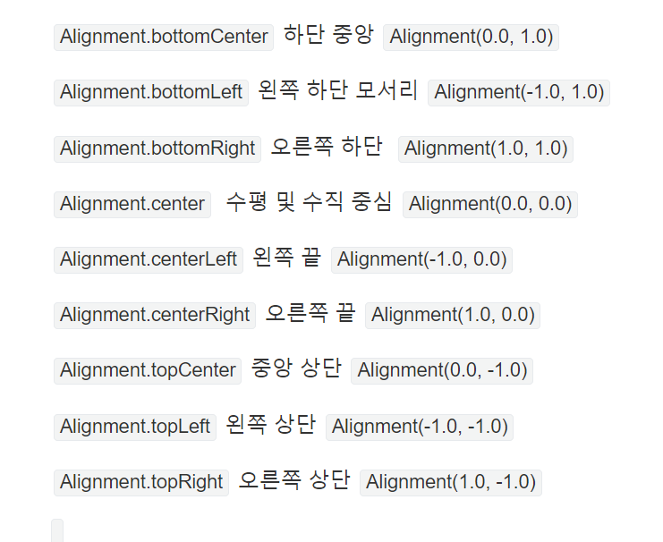

# 16. [Flutter] UI 구성


## 공부한 내용
---

## Flexible

UI 비율을 기반으로 더 유연하게 만들어준다.

flex 값을 통해서 비율을 정한다.

```dart title='flexible'
body: Column(
  children: [
    Flexible(
      flex: 1,
      child: Container(
        decoration: const BoxDecoration(
          color: Colors.red,
        ),
      ),
    ),
    Flexible(
      flex: 2,
      child: Container(
        decoration: const BoxDecoration(
          color: Colors.green,
        ),
      ),
    ),
    Flexible(
      flex: 1,
      child: Container(
        decoration: const BoxDecoration(
          color: Colors.blue,
        ),
      ),
    ),
  ],
),
```

위와 같이 구성한다면



위와 같은 사진으로 나오게 된다 ! 이런 느낌




alignment 정리 사진

조정 가능