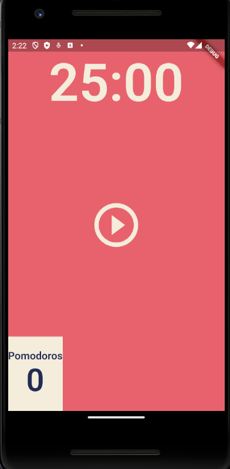
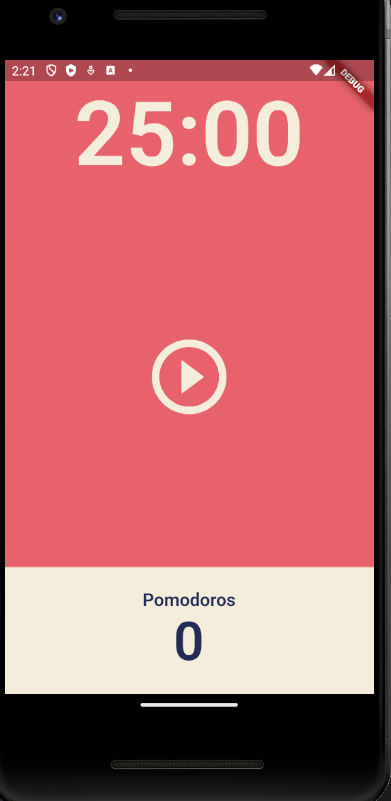

# 16. [Flutter] UI 구성


## 공부한 내용
---

## Flexible

UI 비율을 기반으로 더 유연하게 만들어준다.

flex 값을 통해서 비율을 정한다.

```dart title='flexible'
body: Column(
  children: [
    Flexible(
      flex: 1,
      child: Container(
        decoration: const BoxDecoration(
          color: Colors.red,
        ),
      ),
    ),
    Flexible(
      flex: 2,
      child: Container(
        decoration: const BoxDecoration(
          color: Colors.green,
        ),
      ),
    ),
    Flexible(
      flex: 1,
      child: Container(
        decoration: const BoxDecoration(
          color: Colors.blue,
        ),
      ),
    ),
  ],
),
```

위와 같이 구성한다면


위와 같은 사진으로 나오게 된다 ! 이런 느낌


## Alignment
---


alignment를 사용해서 위젯의 위치를 이동시킬 수 있다.

예시는 아래와 같다.

```dart
Flexible(
  flex: 1,
  child: Container(
      alignment: Alignment.bottomCenter,
      child: Text(
        '25:00',
        style: TextStyle(
          color: Theme.of(context).cardColor,
          fontSize: 100,
          fontWeight: FontWeight.w600,
        ),
      )),
),
```


## Expanded

```dart
Flexible(
  flex: 1,
  child: Row(
    children: [
      Expanded(
        child: Container(
          decoration:
              BoxDecoration(color: Theme.of(context).cardColor),
        ...
        ),
      ),
    ],
  ),
),
```

위처럼 Expanded를 사용하면 화면이 확장된다.


### Befor Expanded




### After Expanded

