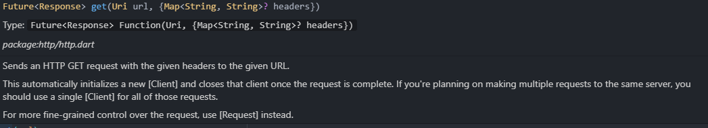

# 19. [Flutter] HTTP Request & Response

:::tip 목차
1. [코드](#코드)
2. [공부한 내용](#공부한-내용)
:::

## 코드
---

```dart title="service"
import 'dart:convert';

import 'package:http/http.dart' as http;
import 'package:webtoon_app/models/webtoon.dart';

class ApiService {
  final String baseURL = "https://webtoon-crawler.nomadcoders.workers.dev";
  final String today = "today";

  Future<List<WebtoonModel>> getToday() async {
    List<WebtoonModel> webtoonInstances = [];
    final url = Uri.parse('$baseURL/$today');
    final response = await http.get(url);
    if (response.statusCode == 200) {
      final List<dynamic> webtoons = jsonDecode(response.body);
      for (var webtoon in webtoons) {
        webtoonInstances.add(WebtoonModel.fromJson(webtoon));
      }

      return webtoonInstances;
    }
    throw Error();
  }
}
```

```dart title="model"
class WebtoonModel {
  final String title, thumb, id;

  WebtoonModel.fromJson(Map<String, dynamic> json)
      : title = json['title'],
        thumb = json['thumb'],
        id = json['id'];
}
```


## 공부한 내용
---

### dart or Flutter 패키지 찾는 사이트


[dart or Flutter 패키지 찾는 사이트](https://pub.dev/)

**적용 방법**

1. terminal에 명령줄로 설치

2. pubspec.yaml에 dependencies 밑에 추가하여 설치하기


### HTTP 요청 보내는 방법

```dart
import 'package:http/http.dart' as http;

final String baseURL = "https://webtoon-crawler.nomadcoders.workers.dev";
final String today = "today";
final url = Uri.parse('$baseURL/$today');

final response = await http.get(url);
```

위와 같은 방식으로 url을 `Uri.parse`를 사용해서 생성하고 `http.get(url)`을 사용해서 요청하면 응답값을 받을 수 있습니다.

### namespace

```dart
import 'package:http/http.dart' as http;

http.get(url);
```

패키지 이름을 정해서 메소드 사용을 더 명시적으로 할 수 있습니다.

### Future 타입



http get 해서 응답한 데이터의 타입은 Future입니다.

미래의 타입을 받을 값을 알려주는 타입입니다.


### async await

`await` 키워드를 사용하면 해당 명령어의 반환이 끝나야 다음 줄을 읽게하는 비동식 방식으로 사용할 수 있습니다.

`await` 키워드는 `async`로 정의된 함수 내에서만 사용할 수 있습니다.

이것을 비동기 함수라고 부릅니다.

### jsonDecode

```dart
final List<dynamic> webtoons = jsonDecode(response.body);
```

`jsonDecode`는 json 스트링을 json으로 변환시켜주는 함수입니다.

### HTTP class 생성자

```dart
WebtoonModel.fromJson(Map<String, dynamic> json)
      : title = json['title'],
        thumb = json['thumb'],
        id = json['id'];
```

HTTP 요청을 하여 받은 응답 정보들을 class에 저장하려면 위와 같은 방식을 사용하니 잊지 말아야 합니다.