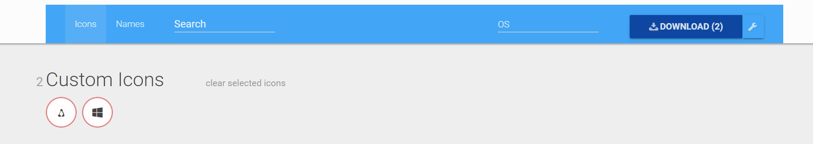

# 29. [flutter] SVG를 IconData로
---

## icondata from svg
---

SVG를 IconData로 만들어야 하는 경우가 있다.

[이곳](https://www.fluttericon.com)에 들어간다.


1. 여기에 svg 떨구기



2. 선택해서 원하는 이름으로 download


```dart
    - family: OS
      fonts:
        - asset: assets/icons/OS.ttf
```

3. 해당 폴더에 OS.ttf 떨구고 pubspec.yaml 파일에 정의

4. 아무 경로에 dart 파일도 떨구기

```dart
icon: zeroData.nodeOSType == "Linux"
    ? OS.icons8_flat_linux
    // if 리눅스
    : zeroData.nodeOSType == "Windows"
        // if 윈도우
        ? OS.windows_logo___2012
        : Icons.computer,
```

5. 사용하기

끝..