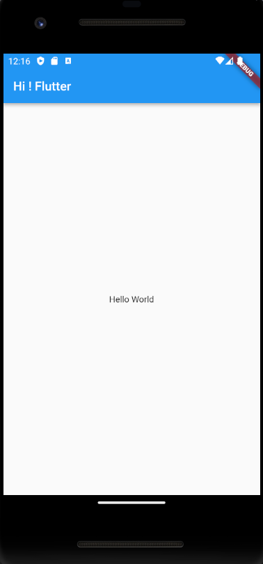

# 03. [Flutter] Hello World

```dart
void main() {
  runApp(MyApp());
}

class MyApp extends StatelessWidget {
  @override
  Widget build(BuildContext context) {
    return MaterialApp(
      home: Scaffold(
        appBar: AppBar(
          title: Text("Hi ! Flutter"),
        ),
        body: Center(
          child: Text("Hello World"),
        ),
      ),
    );
  }
}
```



해당 코드는 위 화면과 같이 나온다.


## 위젯
---

runApp 함수의 필요한 argument는 Widget 타입의 변수다.

Widget은 레고다.

[이 사이트](https://docs.flutter.dev/ui/widgets)에 많은 위젯들이 있음.

다양한 위젯들을 MyApp에 넣어서 실행하는 개념이다.

## StatelessWidget & StatefulWidget
---

### StatelessWidget

`StatelessWidget`은 화면이 로드될 때 한번만 그려지는 State가 없는 위젯으로 변경이 필요한 Data가 없는 것을 의미합니다. 이벤트 또는 사용자 상호작용에 의해 동작하지 않는 Widget입니다.

### StatefulWidget

`StatefulWidget`은 위젯이 동작하는 동안 Data 변경이 필요한 경우 화면을 다시 그려서 변경된 부분을 위젯에 반영하는 동적인 위젯입니다. 이벤트 또는 사용자 상호 작용에 의해 동작합니다.

:::tip아직 잘 모르지만 차이점
`StatelessWidget` = vanilla js
`StatefulWidget` = react
:::

## 오늘 배운 내용

1. 플러터의 화면에는 scaffold가 필요하다.

2. Scaffold 위젯 안에는 appBar와 body로 나눌 수 있다.

3. 문자를 화면에 보이게 하고 싶으면 Text 위젯을 사용한다.

4. 문자를 가운데로 오게 하고 싶으면 Center 위젯을 사용한다.