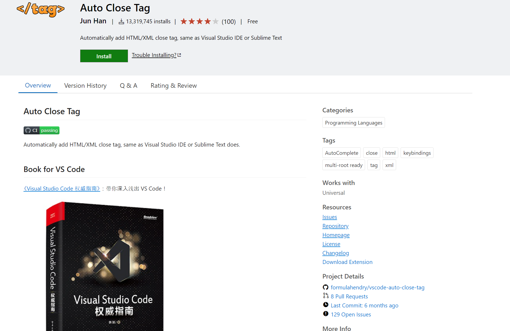
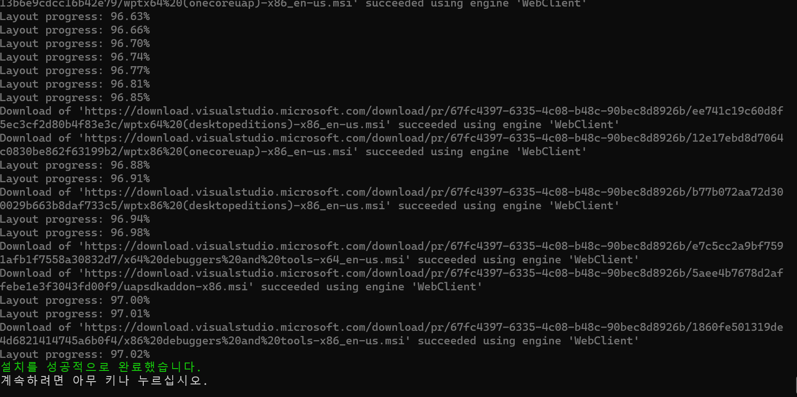

# 49. [flutter] Windows Flutter폐쇄망 개발환경 구축
---

## 준비물

- 사용하던 flutter 폴더
- 사용하던 Cache 폴더
- VS Code
- Visual Studio


## In Online

### SDK 다운로드

SDK 다운로드를 위해서 먼저 `flutter run`을 해줘야합니다. 그럼 PC에서 사용할 수 있는 SDK들을 다운로드 받습니다. 이 과정은 필수입니다.  
MAC용 SDK를 다운로드해야한다면 온라인이되는 MAC OS 장비에서 `flutter run`을 1회 수행해야합니다.

### 압축하기

1. 사용하던 flutter SDK가 있는 폴더를 압축합니다. (경로는 저는 `C:\flutter`였습니다.)

2. 프로젝트의 패키지를 다시 다운로드 받습니다. 

```bash
flutter pub cache repair
```

3. 사용하던 `Pub`를 압축합니다. (경로는 `C:\Users\User\AppData\Local\Pub`을 압축합니다.)


### VS Code

1. Visual Studio Code의 installer를 다운로드 해야합니다.

2. 확장 프로그램은 Extansions를 눌러서 URL로 이동합니다.

누른다면 [이런 곳](https://marketplace.visualstudio.com/items?itemName=formulahendry.auto-close-tag)으로 이동합니다.

3. 우측 하단 Download Extension으로 다운로드 합니다. 그럼 .vsix 파일이 다운로드 됩니다.



4. settings.json도 복사해서 옮길 준비를 해놓습니다.

### Visual Studio

1. [다운로드 링크](https://learn.microsoft.com/en-us/visualstudio/releases/2019/history)를 통해서 Visual Studio의 버전별 `vs_installer.exe`를 다운로드 받을 수 있습니다. 저는 Visual Studio 2019 Professional을 사용해서 vs_Professional.exe를 다운로드 받았습니다.

2. [명령어 참고 링크](https://learn.microsoft.com/ko-kr/visualstudio/install/create-an-offline-installation-of-visual-studio?view=vs-2022)를 참고하시면 layout 패키지 만드는 법에 대해서도 나와있습니다.
[추가 참고 링크](https://ella-devblog.tistory.com/251)를 참고하셔도 좋습니다.

레이아웃을 만들어야하는데 저는 마음 편하게 모두 다운로드 하는 레이아웃을 만들었습니다. 그리고 `cmd.exe`에서 아래 명령어를 실행합니다. 

```bash
vs_Professional.exe --layout C:\\layout --lang ko-KR
```

이거는 모든 패키지 다운로드 하고 한국어만 다운로드 하겠다는 뜻입니다.

그리고 떨어지는 폴더를 압축해서 옮기면 됩니다.



### Git

git installer를 다운로드해서 옮기면 됩니다.


## In Offline


### Git

git installer로 설치하면 됩니다.

### Visual Studio

받아온 파일을 압축해제 하면 나오는 `vs_setup.exe`를 실행해서 설치하면 됩니다.


### 폴더

압축했던 flutter 폴더와 Pub 폴더를 알맞은 위치에 옮깁니다.

이 때 주의할 점이 사용자 이름이 다르면 동작하지 않습니다.. 이건 어떻게 해야하는지 모르겠습니다.

적절한 폴더에 압축해제를 한 후 vs code 설정을 기다립니다..

### VS code
 

그리고 시스템 환경 변수 편집을 해서 Path에 `C:\flutter\bin`을 추가해주고 git safe directory 설정을 해야합니다.

```bash
git config --global --add safe.directory '*'
```

마지막으로 개발자 설정을 On 하면 됩니다.

```bash
start ms-settings:developers
```

를 통해서 개발자 설정을 킬 수 있습니다.

setting.json에서 `dart.offline`을 `true`로 설정합니다.

그럼 `flutter doctor`를 하고 `flutter pub get`하고 `flutter run`을 하면 해결..

