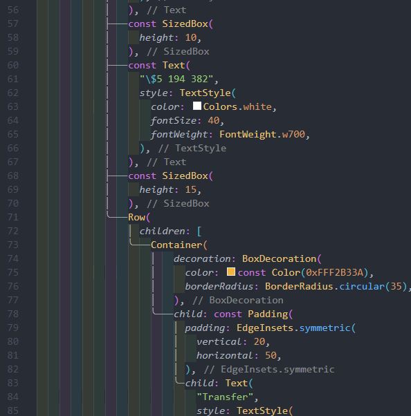

# 06. [Flutter] Flutter를 위한 편리한 VS Code 설정


## 옵션 설정을 위해서

`VS Code` > `Ctrl+Shift+p` > `open user settings` 입력 > json 어쩌구 선택


## const 자동으로 닫아줘서 파란 줄 안뜨는 옵션


```json title='settings.json'
"editor.codeActionsOnSave": {
  "source.fixAll": true
},
```

## 연결선 보여주기

```json title='settings.json'
"dart.previewFlutterUiGuides": true
```

like this

