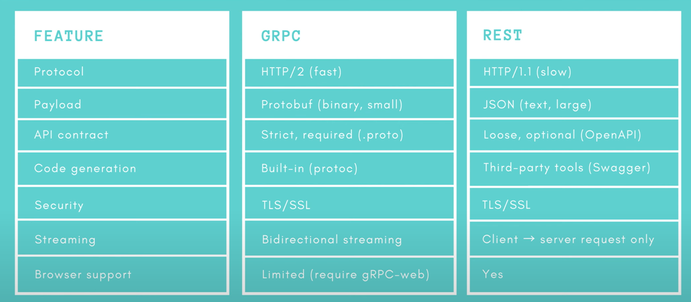

# [gRPC] 1. gRPC 개념

## Q. gRPC가 해결하려는 문제
---

A. 마이크로서비스 아키텍처의 커뮤니케이션을 위해서.

백엔드에는 수많은 언어와 기술과 규칙들이 있기에 통신이 어렵다.

이 통신을 빠르게 하기 위해서  그리고 통신이 단순하기 위해서 

## Q. gRPC가 정확히 뭔지
---

오픈소스 프레임워크

gRPC의 g는 good, green 등등..

RPC = Remote Procedure Calls 절차에 따라 실행하는 것

자동으로 처리된다. 개발자가 네트워크적으로 처리할 필요가 없음.

gRPC에 의해 자동으로 생성되는 stub이 클라이언트에서 서버 역할을 한다(?) 

네트워크를 통해서 간단히 정보 교환을 할 수 있다.

## Protocol Buffer를 사용하는 gRPC
---

gRPC는 Protocol Buffer를 사용한다.

여러 장점이 있다. 간단하고 빠르고.. 여러 언어가 지원합니다.

## HTTP/2
---

gRPC는 전송 프로토콜로 HTTP2를 사용합니다.

전송 가볍고 보안도 훌륭하다.

## gRPC vs REST
---

gRPC는 4가지 타입이 있다.

`UNARY` : 클라이언트에서 단일 요청, 서버에서 단일 응답

`Client Streaming` : 클라이언트에서는 여러 스트림을 보내고 서버에서는 1개의 응답

`Server Streaming` : 클라이언트에서 단일 요청 서버에서는 여러 메시지 스트림

`Bidirectional streaming` : 양방향 스트리밍, 복잡하다 어느쪽도 응답을 받기 전 요청 가능

### rest와 차이점

대부분 gRPC가 좋아보이지만 지원 브라우저에서 gRPC 단점이 드러납니다.

HTTP/1과 HTTP/2를 변환해줄 gRPC-web이 필요합니다.

### 사용처

마이크로 서비스에서 사용하면 좋다.