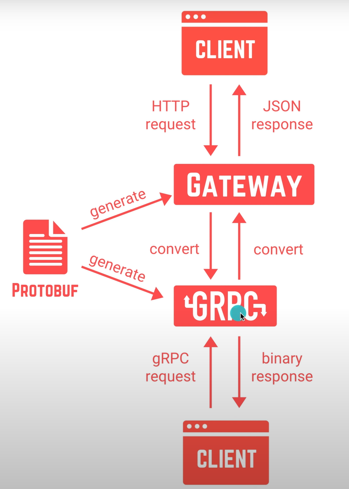

# [gRPC] 5. 다시 gRPC에 대하여

## 작동 방식

1. API 데이터와 구조 정의  
    proto buffer를 사용해서 정의

2. gRPC stub 생성  
    protoc를 사용해서 gRPC 코드 생성

3. 서버 구현

4. 클라이언트 사용

## HTTP Json보다 좋은점

1. 빠르다. HTTP2 전송이고 바이너리 형식으로 전송하기 때문에, 헤더 압축도 함.

2. api contract가 강함

3. 코드 자동 생성

## gRPC gateway

서버 코드를 한번 작성하고 gRPC와 HTTP JSON 동시에 처리할 수 있는 모델

proto buffer plugin이라고 합니다.

gRPC client는 gRPC와 연결되어 바이너리 응답받고 HTTP Client는 Gateway와 연결되어 JSON 응답을 받습니다.

unary에서만 작동한다. streaming 방식으로 사용하려면 gateway를 프록시 서버로 올려야한다.