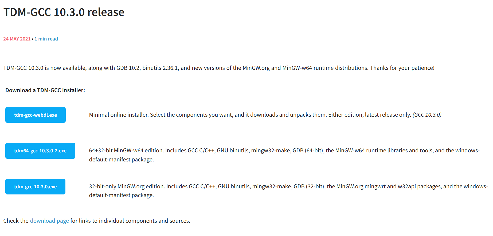

# [Go] dll32 빌드하기
---

## 32 gcc 설치
---

[tdm-gcc 사이트](https://jmeubank.github.io/tdm-gcc/)로 갑니다.




이 중 가운데에 있는 `tdm64-gcc-10.3.0.2.exe`로 다운로드 하고 설치까지 합니다.


## 기존에 gcc가 있는 경우
---

기존에 gcc가 따로 있으면 이 tdm-gcc의 path를 기존 gcc path 위치보다 높이면 됩니다.


## 명령어
---

powershell에서는 

```bash
$env:GOOS='windows'; $env:GOARCH='386'; $env:CGO_ENABLED='1'; $env:CC='gcc'; go build -buildmode=c-shared -o program32.dll ./lib/main/
``` 

makefile에서는 이렇게

```text
build-dll32:
	powershell -Command "$$env:GOOS='windows'; $$env:GOARCH='386'; $$env:CGO_ENABLED='1'; $$env:CC='gcc'; go build -buildmode=c-shared -o $(DLL32_NAME) ./lib/main/"
```

사용합니다.
