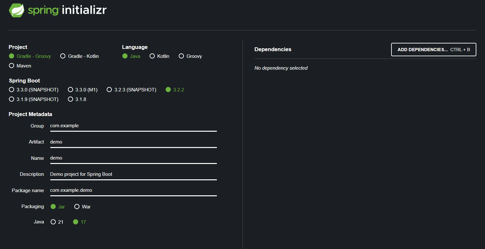

# [Spring] 프로젝트 생성
---

## 자바 설치
---

[Java17 다운로드](https://www.oracle.com/java/technologies/downloads/#jdk17-windows) 링크로 가서 다운로드를 할 수 있다.

Java17을 다운로드하고 환경변수 편집을 하면 된다.

`JAVA_HOME`이라는 이름으로 `C:\Program Files\Java\jdk-17` 이런식의 경로를 넣으면 된다.

`cmd`에서 확인하는 방법은 아래와 같다.

```bash
java -version
```

그럼 17버전이라고 나올 것이다.

## IDE
---

IntelliJ 설치해서 사용한다.


## 스프링 부트
---

[스프링부트 시작하는 사이트](https://start.spring.io/)

위 사이트에서 스프링 부트로 스프링을 간단하게 시작할 수 있다.



### project

`Maven`, `Gradle`는 라이브러리 관리 툴이다. 과거엔 `Maven`이였지만 요즘은 `Gradle`이다 !

### metadata

metadata는 `group`은 그룹 명 `Artifact`는 프로젝트 이름이다.

### dependencies

의존성 추가임

`spring web`, `thymeleaf` 등.. 할 수 있음


## IntelliJ에서 여는 법
---

해당 프로젝트의 build.gradle을 눌러서 open as project 할 수 있음

### 폴더 구조

/src 밑에 `mani`과 `test` 폴더 있다.

`main` 밑에 `java` 밑에 실제 파일 있다.

### 빠른 실행을 위해서

`settings` > `Gradle`에서

Build and run using과 Run tests using을 `IntelliJ IDEA`로 변경하기