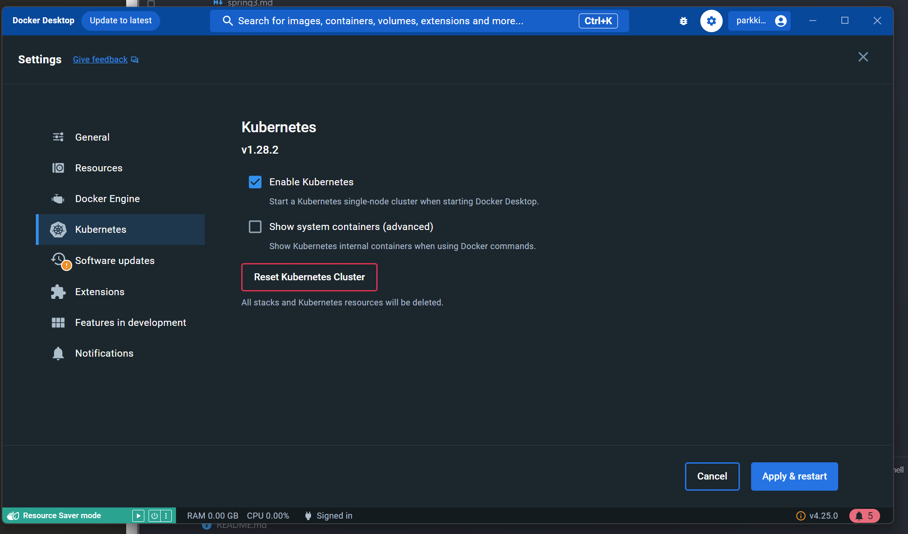

# [Kubernates] 쿠버네티스 시작하기
---

## 쿠버네티스 실습 환경 구축

### Docker Desktop에서 구성

1. Docker Desktop 설치

2. Docker Desktop 실행 > `Setting` > `Kubernetes`로 이동

3. `Enable Kubernetes` 체크 박스 선택 후 `Apply & restart` 클릭



그리고 기다립니다.


### 확인하기

```bash
kubectl version
```

이 명령어를 실행했을 때

```bash
Client Version: v1.28.4
Kustomize Version: v5.0.4-0.20230601165947-6ce0bf390ce3
Server Version: v1.28.2
```

위처럼 나오면 성공


```bash
Client Version: v1.28.4
Kustomize Version: v5.0.4-0.20230601165947-6ce0bf390ce3
Unable to connect to the server: dial tcp 127.0.0.1:56969: connectex: No connection could be made because the target machine actively refused it.
```

이렇게 나오면 실패입니다.


### 실패한 경우 해결법

왜 실패를 하냐면 config 값 중 context가 다른 쿠버네티스를 사용했던 적이 있기 때문입니다.


```bash
kubectl config use-context docker-desktop
```

이렇게 use-context를 변경해주면 잘 됩니다.