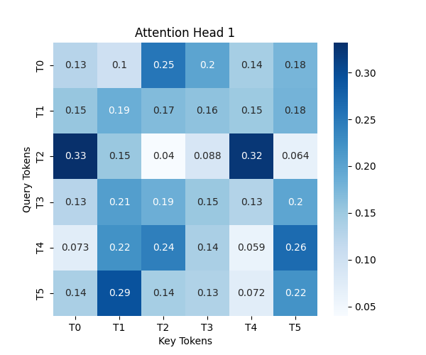
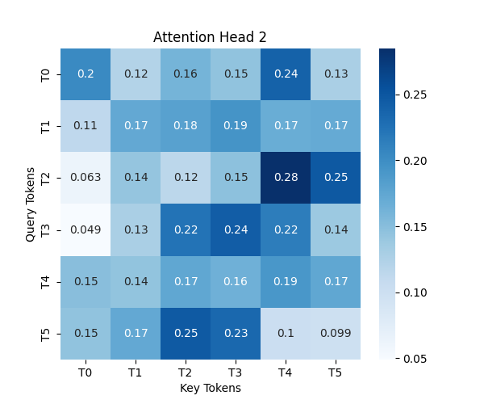

# [LLM] 11. Multi-Head Attention
---

## Multi-Head Attention
---

Multi Head Attention이 뭐냐면 어려운 말로 하자면 Self-Attention을 여러 개 병렬로 수행하여 더 풍부한 문맥 정보를 학습할 수 있도록 하는 것입니다.

간단하게 말하면 Self-Attention을 하면 하나의 관점에서만 Score가 나오는데 그러면 여러 관점을 갖지 못하니까 여러 관점에서 점수를 구할 수 있도록 하는 것이 Multi-Head-Attention 입니다.

### 간단한 예시

아래 문장이 있을 때 Multi-Head-Attnetion을 한다고 보면

- "강아지가 공원에서 신나게 뛰어다닌다"
        - "강아지"가 뭐하니? -> "뛰어다닌다"
        - "어디에서?" -> "공원에서"
        - "기분이 어때?" -> "신나게"

와 같습니다.


### 왜 쓰나?

Self-Attention만 사용하면 토큰을 한가지 방식으로만 이해합니다. Multi-Head Attention을 사용하면 여러 개의 Self-Attention을 사용하는 것과 같기에 다양한 패턴을 학습할 수 있습니다.

### 그래서 다양한 관점을 누가 정하는데

Q,K,V 행렬이 정한다고 할 수 있습니다. Self-Attention도 의미 파악을 위해 Q,K,V가 관여했잖아요. 그거와 같아요.
이 문장만 보면 한가지 의문이 더 들수 있습니다. "그럼 어떤 관점인지를 어떻게 정하나?"라는 의문이 들었었는데. 찾아보니 이는 사람이 지정해줄 수는 없고 랜덤한 값으로 시작하여. 역전파를 통한 미세조정이 이루어져야 한다고 합니다.


## 실습 코드

```python
import torch
import torch.nn as nn
import numpy as np
import pandas as pd
import matplotlib.pyplot as plt
import seaborn as sns
# import ace_tools as tools

# Multi-Head Attention 구현
class MultiHeadAttention(nn.Module):
    def __init__(self, d_model, num_heads):
        super().__init__()
        assert d_model % num_heads == 0  # Head 수가 나누어 떨어지도록 설정
        self.num_heads = num_heads
        self.head_dim = d_model // num_heads
        
        # Query, Key, Value 행렬 생성
        self.W_query = nn.Linear(d_model, d_model)
        self.W_key = nn.Linear(d_model, d_model)
        self.W_value = nn.Linear(d_model, d_model)
        self.out_proj = nn.Linear(d_model, d_model)  # 최종 출력 변환

    def forward(self, x):
        batch_size, seq_length, d_model = x.shape
        
        # Query, Key, Value 생성 및 Head 분할
        Q = self.W_query(x).view(batch_size, seq_length, self.num_heads, self.head_dim).transpose(1, 2)
        K = self.W_key(x).view(batch_size, seq_length, self.num_heads, self.head_dim).transpose(1, 2)
        V = self.W_value(x).view(batch_size, seq_length, self.num_heads, self.head_dim).transpose(1, 2)

        # Scaled Dot-Product Attention 수행
        attn_scores = (Q @ K.transpose(-2, -1)) / (self.head_dim ** 0.5)
        attn_weights = torch.softmax(attn_scores, dim=-1)
        context = attn_weights @ V  # 값 조합

        # Multi-Head Attention 결과 결합
        context = context.transpose(1, 2).contiguous().view(batch_size, seq_length, d_model)
        return self.out_proj(context), attn_weights

# 랜덤 입력 데이터 생성 및 실행 예제
torch.manual_seed(42)
batch_size, seq_length, d_model, num_heads = 1, 6, 8, 2  # 한 문장에 6개의 토큰, 8차원 벡터, 2개의 Head 사용
x = torch.randn(batch_size, seq_length, d_model)  # 랜덤 입력 데이터

# Multi-Head Attention 실행
mha = MultiHeadAttention(d_model, num_heads)
output, attention_weights = mha(x)

# Attention 가중치 시각화
for head in range(num_heads):
    plt.figure(figsize=(6, 5))
    sns.heatmap(attention_weights[0, head].detach().numpy(), annot=True, cmap="Blues", xticklabels=[f"T{i}" for i in range(seq_length)], yticklabels=[f"T{i}" for i in range(seq_length)])
    plt.title(f"Attention Head {head + 1}")
    plt.xlabel("Key Tokens")
    plt.ylabel("Query Tokens")
    plt.show()

# Attention 가중치 데이터프레임 출력
attn_df_head1 = pd.DataFrame(attention_weights[0, 0].detach().numpy(), columns=[f"T{i}" for i in range(seq_length)])
attn_df_head2 = pd.DataFrame(attention_weights[0, 1].detach().numpy(), columns=[f"T{i}" for i in range(seq_length)])

# tools.display_dataframe_to_user(name="Attention Weights - Head 1", dataframe=attn_df_head1)
# tools.display_dataframe_to_user(name="Attention Weights - Head 2", dataframe=attn_df_head2)

print("Attention Weights - Head 1")
print(attn_df_head1)
print("\nAttention Weights - Head 2")
print(attn_df_head2)
```






보면 Head1과 Head2의 연관도 패턴이 다른걸 볼 수 있습니다.

### 결론

Multi-Head Attention은 Self-Attention만 쓰면 효율이 안나오니 병렬처리 해가지구 효율을 극대화한 방법 같습니다.