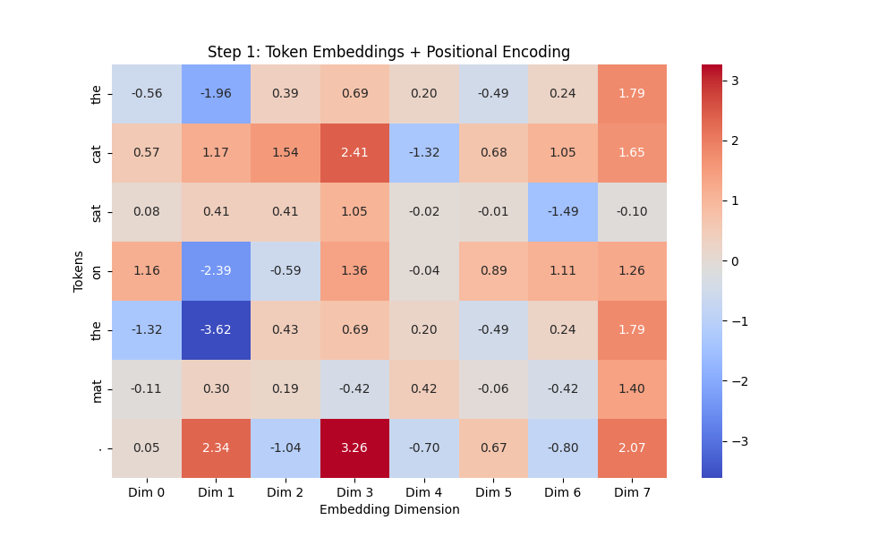
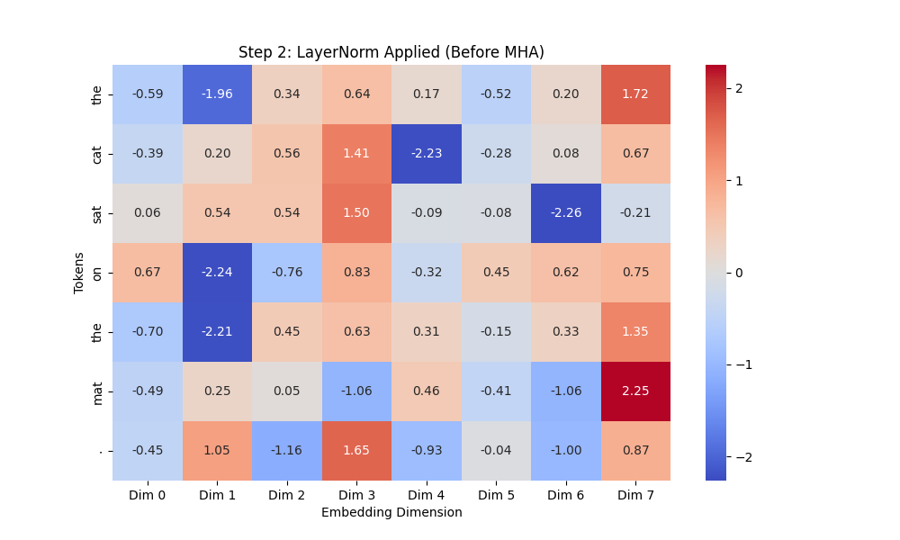
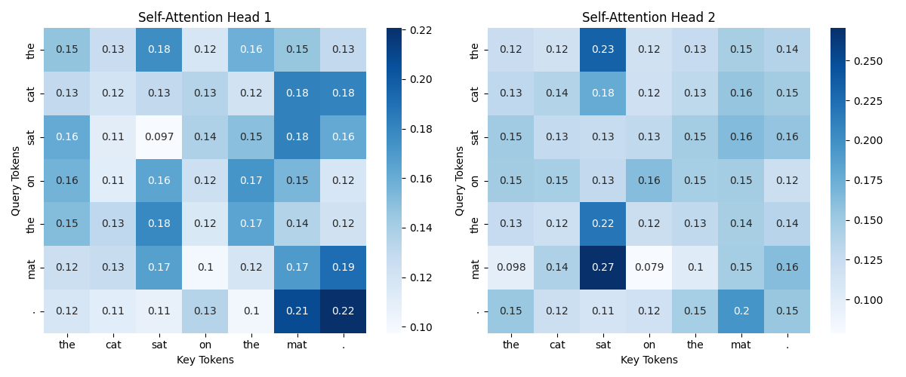
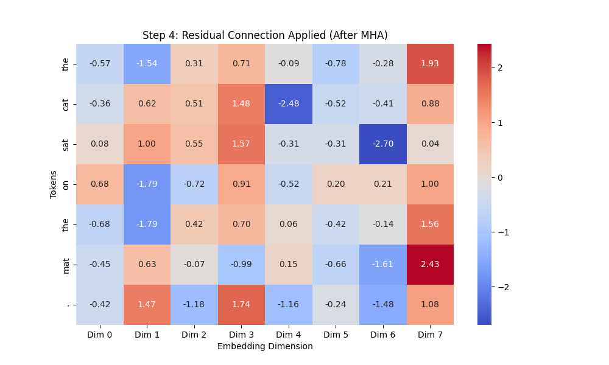
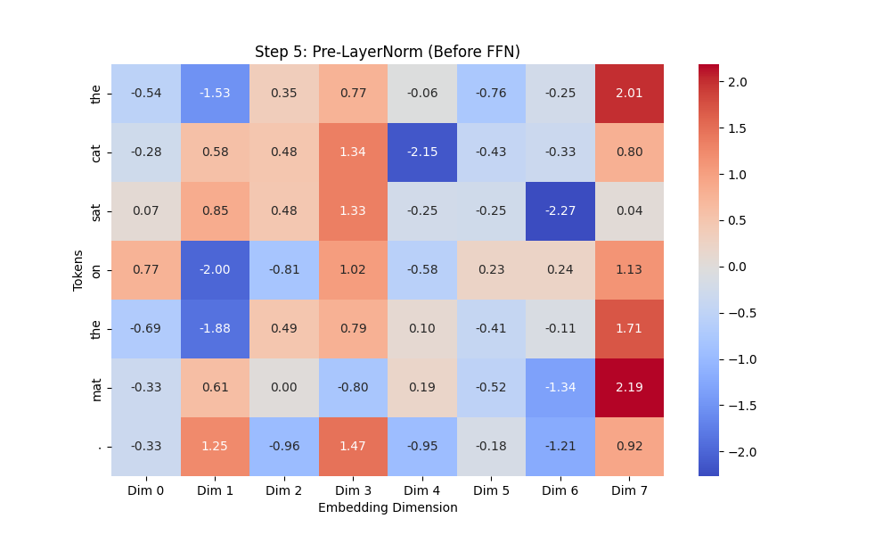
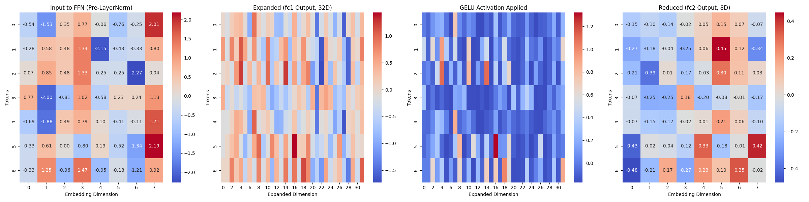
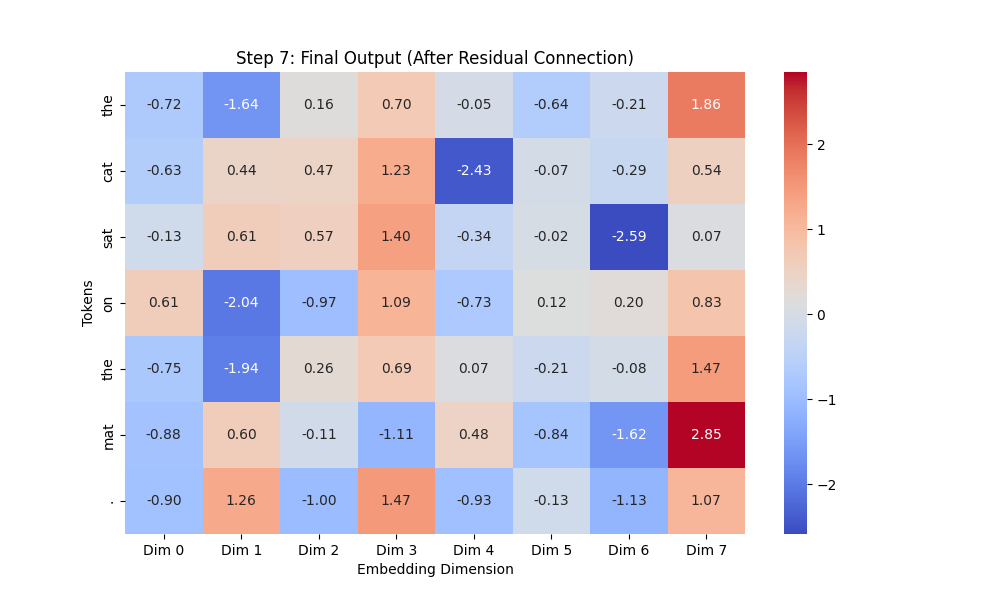

# [LLM] 13. Transformer Block 실습
---

간단한 Transformer Block의 흐름을 따라 히트맵을 보며 어떻게 변화하는지 관찰해보려합니다.


## 계획
---

```text
입력 (Token Embedding + Positional Encoding)  
    ↓  
LayerNorm (Self-Attention 전에 정규화)  
    ↓  
Multi-Head Self-Attention (문장에서 중요한 단어 찾기)  
    ↓  
Residual Connection (원래 정보 유지)  
    ↓  
LayerNorm (FFN 전에 정규화)  
    ↓  
Feed Forward Network (FFN, Self-Attention 결과를 정제)  
    ↓  
Residual Connection (원래 정보 유지)  
    ↓  
출력 (다음 Transformer 블록으로 전달 or 최종 예측)

```

이 실행 흐름대로 어떻게 변화하는지 확인해볼 것입니다.


## 입력 (Token Embedding + Positional Encoding)
---

```python

# -----------------------------
# Step 1: Token Embedding + Sinusoidal Positional Encoding
# -----------------------------
class PositionalEncoding:
    def __init__(self, max_len, d_model):
        self.encoding = self.get_positional_encoding(max_len, d_model)

    @staticmethod
    def get_positional_encoding(max_len, d_model):
        pos_enc = np.zeros((max_len, d_model))
        for pos in range(max_len):
            for i in range(0, d_model, 2):
                pos_enc[pos, i] = np.sin(pos / (10000 ** ((2 * i) / d_model)))
                if i + 1 < d_model:
                    pos_enc[pos, i + 1] = np.cos(pos / (10000 ** ((2 * i) / d_model)))
        return pos_enc

# 설정
vocab = {"the": 0, "cat": 1, "sat": 2, "on": 3, "mat": 4, ".": 5}
sentence = ["the", "cat", "sat", "on", "the", "mat", "."]
embedding_dim = 8  
max_len = len(sentence)

# 임베딩
embedding_layer = nn.Embedding(len(vocab), embedding_dim)
token_indices = torch.tensor([vocab[word] for word in sentence])
token_embeddings = embedding_layer(token_indices).detach().numpy()

# Positional Encoding 추가
pos_encoding = PositionalEncoding(max_len, embedding_dim).encoding
input_embeddings = token_embeddings + pos_encoding

# 히트맵 출력 (Step 1)
plt.figure(figsize=(10, 6))
sns.heatmap(input_embeddings, annot=True, fmt=".2f", cmap="coolwarm", xticklabels=[f"Dim {i}" for i in range(embedding_dim)], yticklabels=sentence)
plt.title("Step 1: Token Embeddings + Positional Encoding")
plt.xlabel("Embedding Dimension")
plt.ylabel("Tokens")
plt.show()
```

### 결과 이미지




## LayerNorm (Self-Attention 전에 정규화) 
---

```python

# -----------------------------
# Step 2: LayerNorm 적용
# -----------------------------
layer_norm = nn.LayerNorm(embedding_dim)
normalized_embeddings = layer_norm(torch.FloatTensor(input_embeddings)).detach().numpy()

# 히트맵 출력 (Step 2)
plt.figure(figsize=(10, 6))
sns.heatmap(normalized_embeddings, annot=True, fmt=".2f", cmap="coolwarm", xticklabels=[f"Dim {i}" for i in range(embedding_dim)], yticklabels=sentence)
plt.title("Step 2: LayerNorm Applied (Before MHA)")
plt.xlabel("Embedding Dimension")
plt.ylabel("Tokens")
plt.show()

```

- ✅ 확인할 점
    - 평균 0, 분산 1로 정규화 됐는가
    - 큰 값과 작은 값이 어떻게 변화했나

### 결과 이미지




## Multi-Head Self-Attention (문장에서 중요한 단어 찾기)  
---

```python
# -----------------------------
# Step 3: Multi-Head Self-Attention
# -----------------------------
class MultiHeadAttention(nn.Module):
    def __init__(self, d_model, num_heads):
        super().__init__()
        assert d_model % num_heads == 0  # Head 수가 나누어 떨어지도록 설정
        self.num_heads = num_heads
        self.head_dim = d_model // num_heads
        
        # Query, Key, Value 행렬 생성
        self.W_query = nn.Linear(d_model, d_model)
        self.W_key = nn.Linear(d_model, d_model)
        self.W_value = nn.Linear(d_model, d_model)
        self.out_proj = nn.Linear(d_model, d_model)  # 최종 출력 변환

    def forward(self, x):
        batch_size, seq_length, d_model = x.shape
        
        # Query, Key, Value 생성 및 Head 분할
        Q = self.W_query(x).view(batch_size, seq_length, self.num_heads, self.head_dim).transpose(1, 2)
        K = self.W_key(x).view(batch_size, seq_length, self.num_heads, self.head_dim).transpose(1, 2)
        V = self.W_value(x).view(batch_size, seq_length, self.num_heads, self.head_dim).transpose(1, 2)

        # Scaled Dot-Product Attention 수행
        attn_scores = (Q @ K.transpose(-2, -1)) / (self.head_dim ** 0.5)
        attn_weights = torch.softmax(attn_scores, dim=-1)
        context = attn_weights @ V  # 값 조합

        # Multi-Head Attention 결과 결합
        context = context.transpose(1, 2).contiguous().view(batch_size, seq_length, d_model)
        return self.out_proj(context), attn_weights

# 실행
torch.manual_seed(42)
num_heads = 2  
x = torch.FloatTensor(normalized_embeddings).unsqueeze(0)  # Batch 차원 추가

# Multi-Head Attention 실행
mha = MultiHeadAttention(embedding_dim, num_heads)
output, attention_weights = mha(x)

# 가로로 여러 개의 Attention Head를 한 줄에 시각화
fig, axes = plt.subplots(1, num_heads, figsize=(6 * num_heads, 5))

for head in range(num_heads):
    ax = axes[head] if num_heads > 1 else axes
    sns.heatmap(attention_weights[0, head].detach().numpy(), annot=True, cmap="Blues",
                xticklabels=sentence, yticklabels=sentence, ax=ax)
    ax.set_title(f"Self-Attention Head {head + 1}")
    ax.set_xlabel("Key Tokens")
    ax.set_ylabel("Query Tokens")

plt.tight_layout()
plt.show()
```

- ✅ 확인할 점
    - Head1 과 Head2가 어떻게 학습 됐는지 확인하기

### 결과 이미지



## Residual Connection (원래 정보 유지)
---

```python
# -----------------------------
# Step 4: Residual Connection
# -----------------------------

# Residual Connection 적용
residual_output = x + output  # 원래 입력(x) + MHA 출력(output)

# 히트맵 출력 (Step 4)
plt.figure(figsize=(10, 6))
sns.heatmap(residual_output.squeeze(0).detach().numpy(), annot=True, fmt=".2f", cmap="coolwarm",
            xticklabels=[f"Dim {i}" for i in range(embedding_dim)], yticklabels=sentence)
plt.title("Step 4: Residual Connection Applied (After MHA)")
plt.xlabel("Embedding Dimension")
plt.ylabel("Tokens")
plt.show()
```

- ✅ 확인할 점
    - MHA를 통과 후 너무 값이 커지거나 변형됐나?
    - 특정 차원에서 값이 극단적으로 변경됐나?

### 결과 이미지




## LayerNorm (FFN 전에 정규화)  
---

```python
# -----------------------------
# Step 5: Pre-LayerNorm 적용 (Before FFN)
# -----------------------------

# 1️⃣ FFN 전 LayerNorm 적용 (Pre-LayerNorm 유지)
ffn_layer_norm = nn.LayerNorm(embedding_dim)
normalized_ffn_input = ffn_layer_norm(residual_output)  # FFN 전 정규화

# 히트맵 출력 (Step 5)
plt.figure(figsize=(10, 6))
sns.heatmap(normalized_ffn_input.squeeze(0).detach().numpy(), annot=True, fmt=".2f", cmap="coolwarm",
            xticklabels=[f"Dim {i}" for i in range(embedding_dim)], yticklabels=sentence)
plt.title("Step 5: Pre-LayerNorm (Before FFN)")
plt.xlabel("Embedding Dimension")
plt.ylabel("Tokens")
plt.show()
```

- ✅ 확인할 점
    - FFN 전에 LayerNorm이 어케 적용됐나.
    - 평균 0, 분산 1인가

### 결과 이미지



## Feed Forward Network (FFN, Self-Attention 결과를 정제)
---

```python
# -----------------------------
# Step 6: FFN 내부 과정 (확장 → GELU → 축소) 시각화
# -----------------------------

# 1️⃣ FFN 레이어 정의
class FeedForwardNetwork(nn.Module):
    def __init__(self, d_model, hidden_dim):
        super().__init__()
        self.fc1 = nn.Linear(d_model, hidden_dim)  # 입력 차원 -> 확장 차원
        self.gelu = nn.GELU()  # GELU 활성화 함수 적용
        self.fc2 = nn.Linear(hidden_dim, d_model)  # 확장된 차원 -> 원래 차원

    def forward(self, x):
        x_expanded = self.fc1(x)  # 확장된 차원 (32차원)
        x_gelu = self.gelu(x_expanded)  # GELU 활성화 적용
        x_output = self.fc2(x_gelu)  # 다시 원래 차원으로 축소
        return x_expanded, x_gelu, x_output

# 2️⃣ FFN 실행 (GELU 적용)
hidden_dim = 32  # 내부 확장 차원 설정 (Transformer 기본: 4배 확장)
ffn = FeedForwardNetwork(embedding_dim, hidden_dim)

# FFN의 각 단계별 출력 얻기
expanded_output, gelu_output, ffn_output = ffn(normalized_ffn_input)  # FFN 적용

# 3️⃣ FFN 과정 가로 비교 그래프 생성
fig, axes = plt.subplots(1, 4, figsize=(24, 6))

# (1) FFN 입력 (Pre-LayerNorm 후)
sns.heatmap(normalized_ffn_input.squeeze(0).detch().numpy(),annot=True,fmt=".2f", cmap="coolwarm", ax=axes[0])
axes[0].set_title("Input to FFN (Pre-LayerNorm)")
axes[0].set_xlabel("Embedding Dimension")
axes[0].set_ylabel("Tokens")

# (2) 확장된 차원 (fc1 적용 후)
sns.heatmap(expanded_output.squeeze(0).detach().numpy(), annot=False, cmap="coolwarm", ax=axes[1])
axes[1].set_title("Expanded (fc1 Output, 32D)")
axes[1].set_xlabel("Expanded Dimension")
axes[1].set_ylabel("Tokens")

# (3) GELU 활성화 적용 후
sns.heatmap(gelu_output.squeeze(0).detach().numpy(), annot=False, cmap="coolwarm", ax=axes[2])
axes[2].set_title("GELU Activation Applied")
axes[2].set_xlabel("Expanded Dimension")
axes[2].set_ylabel("Tokens")

# (3) 다시 원래 차원으로 축소 (fc2 적용 후)
sns.heatmap(ffn_output.squeeze(0).detach().numpy(), annot=True,fmt=".2f", cmap="coolwarm", ax=axes[3])
axes[3].set_title("Reduced (fc2 Output, 8D)")
axes[3].set_xlabel("Embedding Dimension")
axes[3].set_ylabel("Tokens")

plt.tight_layout()
plt.show()
```

- ✅ 확인할 점
    - Layer 확장
    - GELU 활성화 후 값의 변화
    - Layer 축소

### 결과 이미지



## Residual Connection (원래 정보 유지)

```python
# -----------------------------
# Step 7: Residual Connection 적용 (Final Output)
# -----------------------------

# 1️⃣ Residual Connection 적용 (FFN 후 원래 정보 유지)
final_output = residual_output + ffn_output  # Residual 연결

# 2️⃣ Transformer 블록 최종 출력 확인 (히트맵 출력)
plt.figure(figsize=(10, 6))
sns.heatmap(final_output.squeeze(0).detach().numpy(), annot=True, fmt=".2f", cmap="coolwarm",
            xticklabels=[f"Dim {i}" for i in range(embedding_dim)], yticklabels=sentence)
plt.title("Step 7: Final Output (After Residual Connection)")
plt.xlabel("Embedding Dimension")
plt.ylabel("Tokens")
plt.show()
```

- ✅ 확인할 점
    - 최종 벡터가 잘 나왔나

### 결과 이미지

