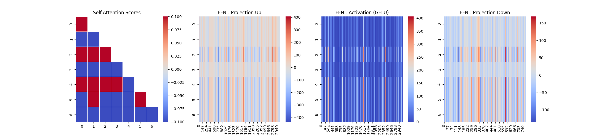

# [LLM] 14. FFN(Feed Forward Network)
---

## FFN이란
---

FFN은 Transformer 블록 내에서 토큰을 개별적으로 가공하는 중요한 신경망 모듈입니다.

Self-Attention이 문맥을 반영한 정보를 전달하면 FFN은 이를 더 정교하게 하여 풍부한 의미를 갖는 표현으로 만든다고 합니다.

### FFN 동작 방식

1. 차원확장
    - 입력토큰을 더 넓은 차원으로 변환합니다.

2. 비선형 변환
    - GELU를 적용하여 더욱 복잡한 패턴을 학습하도록 합니다.

3. 차원 축소
    - 다시 차원을 축소하여 모델이 효율적으로 처리할 수 있도록 합니다.


### ReLU vs GELU

- ✅ ReLU (Rectified Linear Unit)
    - 양수는 남기고 음수를 0으로 바꾸는 함수입니다.
    - 불필요한 정보를 제거해서 더 간결한 표현을 만들고자 하는 목표를 갖고 있습니다.

- ✅ GELU (Gaussiian Error Linear Unit)
    - ReLU보다 조금 더 부드럽게 처리합니다. 약한 음수를 조금 남겨둡니다.
    - 작은 값들은 0 근처에서 천천히 변하고 큰 값들은 빠르게 증가합니다.

### 비선형 함수를 사용해야 하는 이유

선형 계층만 있다면 하나의 선형 변환을 한 효과만 나타난다고 합니다. 수학적인 부분이라 넘어가도록 합니다.


## 실습 코드
---


```python
# ================================
# 3️⃣ FFN 과정 (차원 확장 → 비선형 → 차원 축소)
# ================================
expanded_dim = embed_dim * 4
linear1 = nn.Linear(embed_dim, expanded_dim)
activation = nn.GELU()
linear2 = nn.Linear(expanded_dim, embed_dim)

ffn_expanded = linear1(attn_output)  
ffn_activated = activation(ffn_expanded)  
ffn_output = linear2(ffn_activated)  

# ================================
# 4️⃣ Heatmap 시각화
# ================================
fig, axes = plt.subplots(1, 4, figsize=(22, 5))

# Self-Attention Scores Heatmap
sns.heatmap(attn_scores.detach().numpy(), ax=axes[0], annot=False, cmap="coolwarm", linewidths=0.5)
axes[0].set_title("Self-Attention Scores")

# FFN - 차원 확장 Heatmap
sns.heatmap(ffn_expanded.detach().numpy(), ax=axes[1], annot=False, cmap="coolwarm")
axes[1].set_title("FFN - Projection Up")

# FFN - 비선형 활성화 Heatmap
sns.heatmap(ffn_activated.detach().numpy(), ax=axes[2], annot=False, cmap="coolwarm")
axes[2].set_title("FFN - Activation (GELU)")

# FFN - 차원 축소 Heatmap
sns.heatmap(ffn_output.detach().numpy(), ax=axes[3], annot=False, cmap="coolwarm")
axes[3].set_title("FFN - Projection Down")

plt.show()

```

self_attention score를 구한 값에 ffn을 적용한 모습을 한번 확인해봤습니다.




이런식으로 동작함을 이해할 수 있었습니다..