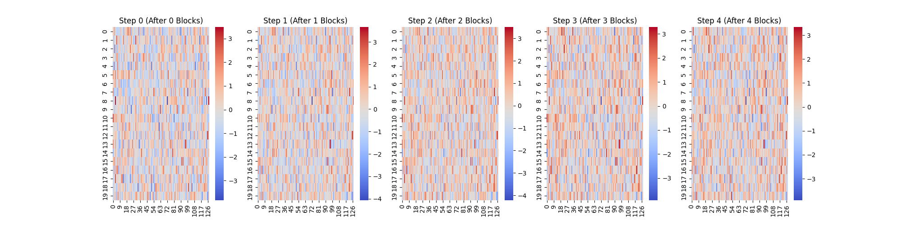
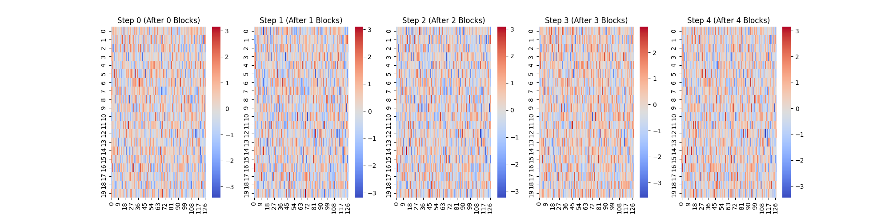

# [LLM] 14. Transformer Block 연결하기
---

Transformer Block을 연결하여 GPT 모델을 만들어 보는 것을 목표로 합니다.

## Transformer Block 실습 코드
---


```python
import torch
import torch.nn as nn

class TransformerBlock(nn.Module):
    """
    d_model: 입력 차원 크기
    num_heads: Multi-Head Attention에서 사용할 Attention Head 개수
    dropout: 과적합 방지를 위한 드롭아웃 비율
    context_length: 한번에 처리할 수 있는 최대 문장 길이
    """
    def __init__(self, d_model, num_heads, dropout, context_length):
        super().__init__()
        
        # Layer Normalization (Pre-LayerNorm 방식)
        self.ln1 = nn.LayerNorm(d_model)
        self.ln2 = nn.LayerNorm(d_model)
        
        # Multi-Head Attention (MHA)
        self.attn = nn.MultiheadAttention(embed_dim=d_model, num_heads=num_heads, dropout=dropout, batch_first=True)

        # Feed Forward Network (FFN)
        self.ffn = nn.Sequential(
            nn.Linear(d_model, d_model * 4),  # 확장 (기본적으로 4배 크기로 증가)
            nn.GELU(),  # 활성화 함수
            nn.Linear(d_model * 4, d_model),  # 다시 원래 크기로 축소
            nn.Dropout(dropout),
        )

    def forward(self, x, mask=None):
        # Multi-Head Attention (Self-Attention)
        x = self.ln1(x)
        attn_out,_ = self.attn(x,x,x,attn_mask=mask,need_weights=False)
        x = x + attn_out # residual_connection

        # Feed Forward Network (FFN)
        x = self.ln2(x)
        ffn_out = self.ffn(x)
        x = x + ffn_out # residual_connection
        
        return x

```

### 흐름

```text
Pre-LayerNorm(For Self-Attention) > Self-Attention > Residual connection >Pre-LayerNorm(For FFN) >  FFN > Residual connection 
```


### 시각화

```python

# 모델 설정
d_model = 128   # 임베딩 차원
num_heads = 4   # Attention Head 개수
num_layers = 4  # Transformer Block 개수
dropout = 0.1   # 드롭아웃 비율
context_length = 20  # 문장의 최대 길이

# 여러 개의 Transformer Block 쌓기
transformer_blocks = nn.ModuleList([
    TransformerBlock(d_model,num_heads,dropout,context_length) for _ in range(num_layers)
])

# 가짜 입력 데이터 생성
x = torch.randn(1,context_length,d_model)
print("입력 데이터 크기:",x.shape)


# Transformer Block을 통과하면서 벡터 변화 저장
outputs = [x.squeeze(0).detach().numpy()]  # 초기 입력 저장

for i, block in enumerate(transformer_blocks):
    x = block(x)
    print(f"Block {i+1} 통과 후 출력 크기:",x.shape)
    outputs.append(x.squeeze(0).detach().numpy())

# 히트맵
# 히트맵 시각화
fig, axes = plt.subplots(1, num_layers + 1, figsize=(20, 5))

for i, output in enumerate(outputs):
    sns.heatmap(output, cmap="coolwarm", ax=axes[i])
    axes[i].set_title(f"Step {i} (After {i} Blocks)")

plt.show()
```




### Casual Mask 적용

```python
class TransformerBlock(nn.Module):
    """
    d_model: 입력 차원 크기
    num_heads: Multi-Head Attention에서 사용할 Attention Head 개수
    dropout: 과적합 방지를 위한 드롭아웃 비율
    context_length: 한번에 처리할 수 있는 최대 문장 길이
    """
    def __init__(self, d_model, num_heads, dropout, context_length):
        super().__init__()

        self.context_length = context_length
        # Layer Normalization (Pre-LayerNorm 방식)
        self.ln1 = nn.LayerNorm(d_model)
        self.ln2 = nn.LayerNorm(d_model)
        
        # Multi-Head Attention (MHA)
        self.attn = nn.MultiheadAttention(embed_dim=d_model, num_heads=num_heads, dropout=dropout, batch_first=True)

        # Feed Forward Network (FFN)
        self.ffn = nn.Sequential(
            nn.Linear(d_model, d_model * 4),  # 확장 (기본적으로 4배 크기로 증가)
            nn.GELU(),  # 활성화 함수
            nn.Linear(d_model * 4, d_model),  # 다시 원래 크기로 축소
            nn.Dropout(dropout),
        )

        # 미리 causal mask를 만들어두기
        self.register_buffer("causal_mask", self._create_causal_mask(context_length))

    def _create_causal_mask(self, seq_length):
        """
        상삼각 행렬을 만들어서 미래 단어를 보지 못하도록 함.
        """
        mask = torch.triu(torch.ones(seq_length, seq_length), diagonal=1)
        mask = mask.masked_fill(mask == 1, float('-inf'))
        return mask

    def forward(self, x, mask=None):
        # 입력 시퀀스 확인
        seq_length = x.size(1)
        if mask is None:
            mask = self._create_causal_mask(seq_length).to(x.device) 

        # Multi-Head Attention (Self-Attention)
        x = self.ln1(x)
        attn_out,_ = self.attn(x,x,x,attn_mask=mask,need_weights=False)
        x = x + attn_out # residual_connection

        # Feed Forward Network (FFN)
        x = self.ln2(x)
        ffn_out = self.ffn(x)
        x = x + ffn_out # residual_connection
        
        return x
```


```python

# 모델 설정
d_model = 128   # 임베딩 차원
num_heads = 4   # Attention Head 개수
num_layers = 4  # Transformer Block 개수
dropout = 0.1   # 드롭아웃 비율
context_length = 20  # 문장의 최대 길이

# 여러 개의 Transformer Block 쌓기
transformer_blocks = nn.ModuleList([
    TransformerBlock(d_model,num_heads,dropout,context_length) for _ in range(num_layers)
])

# 가짜 입력 데이터 생성
x = torch.randn(1,context_length,d_model)
print("입력 데이터 크기:",x.shape)

# Transformer Block을 통과하면서 벡터 변화 저장
outputs = [x.squeeze(0).detach().numpy()]  # 초기 입력 저장

for i, block in enumerate(transformer_blocks):
    x = block(x)  # Causal Mask 적용
    outputs.append(x.squeeze(0).detach().numpy())  # 결과 저장
    print(f"Block {i+1} 통과 후 출력 크기:", x.shape)  # (1, 20, 128) 유지 확인

# 히트맵
# 히트맵 시각화
fig, axes = plt.subplots(1, num_layers + 1, figsize=(20, 5))

for i, output in enumerate(outputs):
    sns.heatmap(output, cmap="coolwarm", ax=axes[i])
    axes[i].set_title(f"Step {i} (After {i} Blocks)")

plt.show()

```


