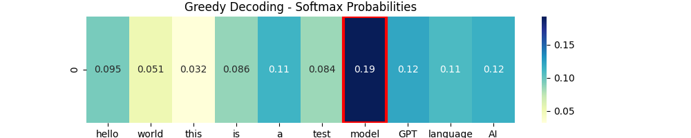
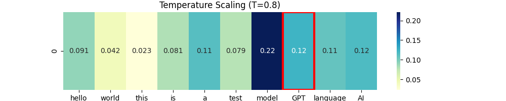
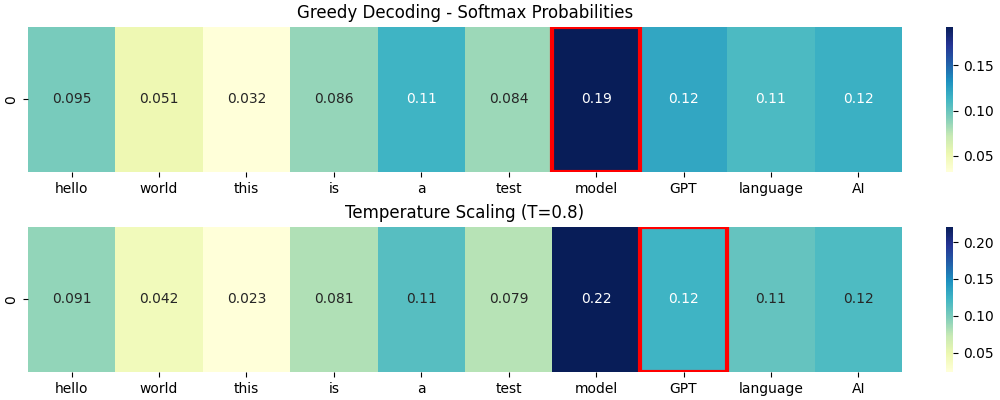
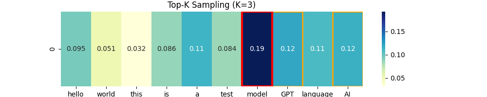
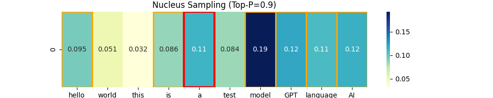
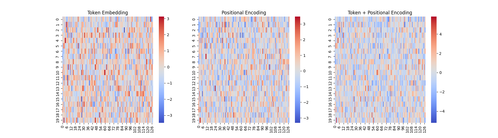

# [LLM] 15. 토큰 입력 부터 단어 예측까지
---

## 텍스트 생성 과정
---

1. 입력 받기
- 처음에 문장을 입력 받습니다.

2. 다음 단어 확률 계산
- 입력 받은 문장 다음에 나올 단어를 예측합니다.

3. 단어 선택 (디코딩 기법)
- 무조건 가장 높은 확률의 단어를 선택하지는 않는다.
- 왜냐하면 다양한 표현을 할 수 있기 때문 !

### 1. Greedy Decoding

> 가장 높은 확률을 무조건 선택하는 방식

- Softmax를 적용해서 확률 가장 높은 단어를 무조건 선택하는 방식입니다.
- 창의성이 부족합니다.


### 2. Temperature Scaling

> 확률 차이를 조절해서 창의성 높이는 방식

- logits를 temperature로 나누어서 활률 분포를 변화시킵니다.
- 0.1~0.5 값을 보수적으로 보고 1.0~2.0을 창의적으로 봅니다.


### 3. Top-k Sampling

> 확률이 높은 K개의 단어 중 랜덤하게 선택하는 방식

- 확률이 높은 상위 K개 단어만 후보로 남기고 그 중에서 랜덤 선택합니다.
- K값이 크면 다양성이 증가하지만 품질이 낮아집니다.


### 4. Nucleus Sampling (Top-p Sampling)

> 확률 합이 P(예를 들어 90%) 이상이 되는 단어들만 선택

- Top-K는 개수를 제한하지만 Nucleus Sampling은 확률의 누적합 기준. (점수를 기준으로)
- 확률이 높은 단어들은 유리하지만 너무 이상한 단어는 자동으로 걸러진다.


### 5. Beam Search

> 여러 개의 후보 문장을 동시에 탐색하여 가장 좋은 결과를 선택

- 여러 개의 후보 문장을 유지하며 탐색하고 각 문장의 확률 계산해서 가장 높은 N개를 유지시켜 놓는다.
- 이 과정을 반복하여 가장 좋은 문장을 선택하고 출력한다.


## 텍스트 생성 실습
---

### Greedy Decoding

```python
# Greedy Decoding (탐욕적 선택)
probs = F.softmax(logits, dim=-1)
greedy_idx = torch.argmax(probs).item()
plot_heatmap(probs, title="Greedy Decoding - Softmax Probabilities", selected_idx=greedy_idx)
```



`Greedy Decoding`은 쉽고 이해를 쉽게할 수 있습니다. 그냥 Softmax 적용 후 가장 확률이 높은 단어를 선택합니다.

- ✅장점
    - 계산 속도 빠름
    - 복잡한 확률 조절 필요하지 않음

- ⛔단점
    - 매번 같은 단어만 나옴.
    - 그래서 문장 단조로워짐.


### Temperature Scaling

```python
temperature = 0.8
scaled_logits = logits / temperature
probs_temp = F.softmax(scaled_logits, dim=-1)
temp_selected_idx = torch.multinomial(probs_temp, num_samples=1).item()
plot_heatmap(probs_temp, title=f"Temperature Scaling (T={temperature})", selected_idx=temp_selected_idx)
```





`Temperature Scaling`은 아래와 같은 공식으로 스케일링을 합니다.

### $scaled\_logits = \frac{logits}{T}$ 

1. logits을 1/T배 스케일링 하고
2. Softmax로 확률화 한 후
3. 분포에 따라 무작위 샘플링을 한다고 하네요.

이게 무작위가 진짜 무작위는 아니고 확률을 기반으로 뽑는다고 합니다.

그래서 Temperature가 1 미만이면 높은 부분에 치우쳐서 샘플링하고 
Temperature가 1이면 원본 확률대로 뽑고
Temperature가 1 초과하면 분포가 평탄해져서 랜덤성이 커집니다.
(왜 랜덤성이 커진다고 표현했냐면 확률 차이가 줄어드니까요)


### Top-K Sampling

Top-K는 temperature를 좀더 보완하는 방식인데. 확률이 높은 k개를 골라서 그 중에서 랜덤하게 고르는 방법이라고 말할 수 있습니다. (여기서 랜덤도 확률적으로?)

이런 방식을 채택하면 논리적이면서 다양한 문장을 만들 수 있다고 하네요.




### Nucleus Sampling (Top-P)

얘는 이제 누적합을 사용한 친군데 누적합 P 이상만 모아서 확률적으로 고르는 애 입니다.

Top-K랑 비슷한데 Top-K는 K개만 고르는건데 Top-P는 누적합 이상만 되면 OK 입니다.

Top-K보다 더 자연스러운 문장을 만들 수 있음. 왜냐하면 좀더 후보가 많아지니까?




## 토큰 임베딩 코드
---

```python

class GPTModel(nn.Module):
    def __init__(self, vocab_size,d_model,num_heads, num_layers,dropout,context_length):
        super().__init__()

        # 1. Token embedding (단어 > 벡터)
        self.token_embedding = nn.Embedding(vocab_size,d_model)

        # 2. position encoding
        self.position_encoding = nn.Embedding(context_length, d_model)
        
        # 3. transformer blocks
        self.blocks = nn.ModuleList([
            TransformerBlock(d_model, num_heads, dropout, context_length) for _ in range(num_layers)
        ])

        # 4. Linear Projection
        self.ln_final = nn.LayerNorm(d_model)
        self.output_layer = nn.Linear(d_model,vocab_size)
        
    def forward(self, input_ids, mask=None):
        # 1. token embedding 적용
        token_embeds = self.token_embedding(input_ids)

        # 2. position embedding 적용
        pos_embeds = self.position_encoding(torch.arange(input_ids.shape[1],device=input_ids.device))

        # token embedding + position encoding
        x = token_embeds + pos_embeds

        # 4. transformer block 통과
        for block in self.blocks:
            x = block(x, mask)
        
        # 5. 최종
        x = self.ln_final(x)
        logits = self.output_layer(x)

        return logits
```


### 시각화 해서 확인

```python
# 모델 설정
vocab_size = 100    # 단어 개수
d_model = 128       # 임베딩 차원
context_length = 20 # 최대 문장 길이

# GPT 모델 생성
model = GPTModel(vocab_size,d_model,num_heads=4,num_layers=4,dropout=0.1,context_length=context_length)

# 가짜 데이터
input_ids = torch.randint(0,vocab_size,(1,context_length))

with torch.no_grad():
    token_embeds = model.token_embedding(input_ids).squeeze(0).numpy()  # (seq_length, d_model)
    pos_embeds = model.position_encoding(torch.arange(context_length)).numpy()  # (seq_length, d_model)
    combined_embeds = token_embeds + pos_embeds  # 최종 Transformer 입력

# 🔹 히트맵 시각화 (Embedding 확인)
fig, axes = plt.subplots(1, 3, figsize=(18, 5))

sns.heatmap(token_embeds, cmap="coolwarm", ax=axes[0])
axes[0].set_title("Token Embedding")

sns.heatmap(pos_embeds, cmap="coolwarm", ax=axes[1])
axes[1].set_title("Positional Encoding")

sns.heatmap(combined_embeds, cmap="coolwarm", ax=axes[2])
axes[2].set_title("Token + Positional Encoding")

plt.show()
```




## 예측해보기
---

```python
import torch
import torch.nn.functional as F

from embedding import GPTModel

# 어휘집
vocabulary = ["hello","world","this","is","a","test","model","GPT","language","AI"]
vocabulary_size = len(vocabulary)

# 토큰 인코딩 함수
def encode(text):
    return torch.tensor([vocabulary.index(word) for word in text.split() if word in vocabulary]).unsqueeze(0)

# 토큰 디코딩 함수
def decode(tokens):
    return " ".join([vocabulary[index] for index in tokens])

# 가짜 입력 문장
input_text = "hello world this is"
input_ids = encode(input_text)

# 모델 생성
model = GPTModel(
    vocab_size=vocabulary_size, 
    d_model=128,
    num_heads=4,
    num_layers=4,
    dropout=0.1,
    context_length=vocabulary_size)

model.eval() # 평가 모드

with torch.no_grad():
    logits = model(input_ids)
    next_token_logits = logits[:,-1,:]
    next_token = torch.argmax(F.softmax(next_token_logits,dim=1),dim=-1).item()

# 결과 출력
print(f"입력 문장: {input_text}")
print(f"예측된 다음 단어: {vocabulary[next_token]}")
```

아래 처럼 출력되는데 어차피 랜덤입니다. 왜냐하면 모델을 통해 학습이 된게 아니기 때문입니다.

```text
입력 문장: hello world this is
예측된 다음 단어: test
```


### 여러개 예측하기

```python
def generate(model,tokenizer,start_text,max_new_tokens):
    model.eval()
    input_ids=encode(start_text)

    for _  in range(max_new_tokens):
        with torch.no_grad():
            logits = model(input_ids)
            next_token_logits = logits[:,-1,:]
            next_token = torch.argmax(F.softmax(next_token_logits,dim=1),dim=-1).item()
            
            # 입력에 추가
            input_ids = torch.cat([input_ids, torch.tensor([[next_token]])], dim=1)

    return decode(input_ids.squeeze(0).tolist())

# 실행
generated_text = generate(model, encode, "hello world this is", max_new_tokens=5)
print("🔥 생성된 문장:", generated_text)
```


```text
🔥 생성된 문장: hello world this is a world model AI a
```

이런식으로 여러개 예측할 수 있습니다.. 학습이 된 모델이 아니기에 랜덤값입니다.


## 전에 다뤘던 코드
---

### Transformer Block
```python
class TransformerBlock(nn.Module):
    """
    d_model: 입력 차원 크기
    num_heads: Multi-Head Attention에서 사용할 Attention Head 개수
    dropout: 과적합 방지를 위한 드롭아웃 비율
    context_length: 한번에 처리할 수 있는 최대 문장 길이
    """
    def __init__(self, d_model, num_heads, dropout, context_length):
        super().__init__()

        self.context_length = context_length
        # Layer Normalization (Pre-LayerNorm 방식)
        self.ln1 = nn.LayerNorm(d_model)
        self.ln2 = nn.LayerNorm(d_model)
        
        # Multi-Head Attention (MHA)
        self.attn = nn.MultiheadAttention(embed_dim=d_model, num_heads=num_heads, dropout=dropout, batch_first=True)

        # Feed Forward Network (FFN)
        self.ffn = nn.Sequential(
            nn.Linear(d_model, d_model * 4),  # 확장 (기본적으로 4배 크기로 증가)
            nn.GELU(),  # 활성화 함수
            nn.Linear(d_model * 4, d_model),  # 다시 원래 크기로 축소
            nn.Dropout(dropout),
        )

        # 미리 causal mask를 만들어두기
        self.register_buffer("causal_mask", self._create_causal_mask(context_length))

    def _create_causal_mask(self, seq_length):
        """
        상삼각 행렬을 만들어서 미래 단어를 보지 못하도록 함.
        """
        mask = torch.triu(torch.ones(seq_length, seq_length), diagonal=1)
        mask = mask.masked_fill(mask == 1, float('-inf'))
        return mask

    def forward(self, x, mask=None):
        # 입력 시퀀스 확인
        seq_length = x.size(1)
        if mask is None:
            mask = self._create_causal_mask(seq_length).to(x.device) 

        # Multi-Head Attention (Self-Attention)
        x = self.ln1(x)
        attn_out,_ = self.attn(x,x,x,attn_mask=mask,need_weights=False)
        x = x + attn_out # residual_connection

        # Feed Forward Network (FFN)
        x = self.ln2(x)
        ffn_out = self.ffn(x)
        x = x + ffn_out # residual_connection
        
        return x
```