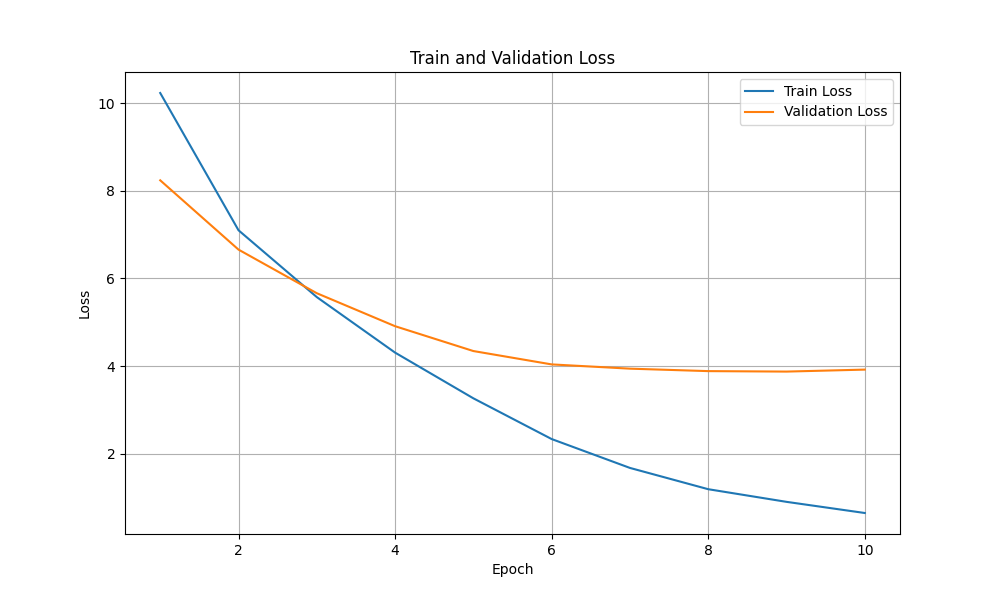

# [LLM] 17. 사전 학습
---

사전 학습을 진행해봤습니다.

## 데이터 준비
---

```python
# 훈련 데이터와 검증 데이터 준비
all_data = [
    ("What is the capital of France?", "The capital of France is Paris."),
    ("What is the capital of Germany?", "The capital of Germany is Berlin."),
    ("How are you?", "I am fine, thank you. And you?"),
    ("What is 2 + 2?", "2 + 2 equals 4."),
    ("Who wrote Harry Potter?", "J.K. Rowling wrote Harry Potter."),
    ("What is the tallest mountain?", "Mount Everest is the tallest mountain."),
    ("When was the first computer invented?", "The first electronic computer was invented in the 1940s."),
    ("What is the boiling point of water?", "Water boils at 100 degrees Celsius at sea level."),
    ("Who painted the Mona Lisa?", "Leonardo da Vinci painted the Mona Lisa."),
    ("What is the capital of Japan?", "The capital of Japan is Tokyo."),
]
```

이런 훈련데이터로 학습하려 했습니다.

```python
def prepare_training_data(data):
    """각 응답 끝에 EOS 토큰을 명시적으로 추가"""
    formatted_data = []
    for question, answer in data:
        # EOS 토큰이 명시적으로 추가된 답변
        formatted_answer = answer + tokenizer.eos_token
        formatted_data.append((question, formatted_answer))
    return formatted_data


tokenizer = GPT2Tokenizer.from_pretrained("gpt2")


# 데이터를 훈련 세트와 검증 세트로 분할 (80% 훈련, 20% 검증)
random.seed(42)  # 재현성을 위한 시드 설정
random.shuffle(all_data)
train_size = int(0.8 * len(all_data))
training_data = all_data[:train_size]
validation_data = all_data[train_size:]

training_data = prepare_training_data(training_data)
validation_data = prepare_training_data(validation_data)
```

이 문장들을 학습할 때 그냥 뒤에 EOS를 붙여서 학습하기로 했습니다.


## 인코딩
---

```python
def encode_text(full_text):
    """
    텍스트를 인코딩하고 입력(input)과 타겟(target) 시퀀스로 분리
    입력: 시퀀스의 처음부터 마지막 토큰 이전까지
    타겟: 시퀀스의 두 번째 토큰부터 끝까지
    """
    encoded = tokenizer.encode(full_text, return_tensors="pt")
    input_ids = encoded[:, :-1]  # 마지막 토큰 제외
    target_ids = encoded[:, 1:]  # 첫 번째 토큰 제외
    return input_ids, target_ids

```

학습을 위한 인코딩 함수입니다.

### 인코딩 함수

`encode_text` 함수는 입력 시퀀스와 정답 시퀀스를 만드는 것과 같습니다.

"Hello World"가 들어왔다고 예를 들고 아래처럼 값이 생성됐다고 가정해봅시다.


```python
encoded =tokenizer.encode("Hello world", return_tensors="pt")
# encoded = [[101, 7592, 2088, 102]]
```

- `101` -> 시작 토큰(CLS)
- `1234` -> "Hello"의 토큰 ID
- `5678` -> "World"의 토큰 ID
- `102` -> 종료 토큰(SEP)

입니다. 그럼 아래처럼 되겠죠?

```text
input_ids = [101,1234,5678]
target_ids = [1234,5678,102]
```

여기까진 이해가 됩니다. 그럼. 그래서 뭐? 라는 의문이 들 수도 있습니다. 뭐냐면

input_ids가 target_ids를 맞춰야하는 겁니다. 표로 보면 이해가 빠른데

|Step|Input|Target|
|---|-----|-----|
|1|101|1234|
|2|101, 1234|5678|
|3|101, 1234, 5678|102|

이런식으로 Input이 들어왔을 때 Target을 예측하도록 학습시킨다고 합니다.

즉. Autoregressive모델이기 때문에 한 단계 씩 예측하면서 학습 하는 겁니다.

`Hello`가 들어오면 `World`가 올걸 예상하고 `Hello World`가 완성되면 종료토큰을 예상하는 겁니다.


## 평가
---

```python
def evaluate(data_set):
    """검증 데이터에 대한 손실 계산"""
    model.eval()  # 모델을 평가 모드로 설정
    total_loss = 0
    
    with torch.no_grad():  # 그래디언트 계산 비활성화
        for input_text, target_text in data_set:
            # 입력과 타겟을 하나의 시퀀스로 연결
            full_text = input_text + " " + target_text
            input_ids, target_ids = encode_text(full_text)
            input_ids, target_ids = input_ids.to(device), target_ids.to(device)
            
            # 모델 예측
            logits = model(input_ids)
            
            # 손실 계산
            loss = criterion(logits.reshape(-1, logits.size(-1)), target_ids.reshape(-1))
            total_loss += loss.item()
    
    # 평균 손실 반환
    return total_loss / len(data_set)
```

훈련에 대한 손실을 평가하는 코드입니다.

no_grad로 하는 이유는 기울기가 필요없어서 입니다.

### 흐름

```python
    full_text = input_text + " " + target_text
    input_ids, target_ids = encode_text(full_text)
    input_ids, target_ids = input_ids.to(device), target_ids.to(device)
```

질문과 정답을 일단 합쳐봅니다. (학습 할 수 있도록)
그리고 tokenid로 만듭니다.


```python
    # 모델 예측
    logits = model(input_ids)
```

입력 토큰아이디를 모델에 넣어서 예측을 진행합니다.

```python
    # 손실 계산
    loss = criterion(logits.reshape(-1, logits.size(-1)), target_ids.reshape(-1))
    total_loss += loss.item()
```

`CrossEntropyLoss`로 손실을 계산합니다. 계산한 손실의 total을 구해놓고 평균을 반환합니다.


## 학습
---

```python
optimizer = optim.AdamW(model.parameters(), lr=5e-5)

# 학습 시작
num_epochs = 10  # 에폭 수 증가
best_val_loss = float('inf')
early_stopping_counter = 0
early_stopping_patience = 5  # 5번 연속으로 개선이 없으면 조기 종료

print("학습 시작...")
for epoch in range(num_epochs):
    model.train()  # 모델을 훈련 모드로 설정
    train_loss = 0
    
    # tqdm으로 진행 상황 표시
    progress_bar = tqdm(training_data, desc=f"Epoch {epoch+1}/{num_epochs}")
    for input_text, target_text in progress_bar:
        # 입력과 타겟을 하나의 시퀀스로 연결
        full_text = input_text + " " + target_text
        input_ids, target_ids = encode_text(full_text)
        input_ids, target_ids = input_ids.to(device), target_ids.to(device)
        
        # 그래디언트 초기화
        optimizer.zero_grad()
        
        # 모델 예측
        logits = model(input_ids)
        
        # 손실 계산
        loss = criterion(logits.reshape(-1, logits.size(-1)), target_ids.reshape(-1))
        
        # 역전파 및 최적화
        loss.backward()
        optimizer.step()
        
        # 손실 기록
        train_loss += loss.item()
        progress_bar.set_postfix({"train_loss": f"{loss.item():.4f}"})
    
    # 평균 훈련 손실 계산
    avg_train_loss = train_loss / len(training_data)
    train_losses.append(avg_train_loss)
    
    # 검증 데이터에 대한 평가
    val_loss = evaluate(validation_data)
    val_losses.append(val_loss)
    
    # 결과 출력
    print(f"Epoch {epoch+1}/{num_epochs}, 훈련 손실: {avg_train_loss:.4f}, 검증 손실: {val_loss:.4f}")
    
    # 조기 종료 검사
    if val_loss < best_val_loss:
        best_val_loss = val_loss
        early_stopping_counter = 0
        # 최상의 모델 저장
        torch.save(model.state_dict(), "best_model.pt")
        print(f"✅ 검증 손실 개선! 모델 저장 (검증 손실: {val_loss:.4f})")
    else:
        early_stopping_counter += 1
        print(f"검증 손실 개선 없음 ({early_stopping_counter}/{early_stopping_patience})")
        
    if early_stopping_counter >= early_stopping_patience:
        print(f"조기 종료: {early_stopping_patience}번 연속으로 검증 손실 개선 없음")
        break
```

학습 시키는 코드입니다.

### 흐름 설명

- **optimizer**


```python
optimizer = optim.AdamW(model.parameters(), lr=5e-5)
```

optimizer를 선언합니다. 가중치 업데이트에 사용됩니다.


- **epoch**

```python
num_epochs = 10

for epoch in range(num_epochs):
    ...

```

epoch 수 만큼 학습을 반복합니다.

- **train mode**

```python
model.train()
```

model을 학습용으로 만듭니다.

- **tqdm**

```python
progress_bar = tqdm(training_data, desc=f"Epoch {epoch+1}/{num_epochs}")
```

`tqdm`은 `taquddum`의 약자로 진행이라는 뜻을 가진 함수인데 진행사항을 시각적으로 보여준다.

- **get token id**

```python
    # 입력과 타겟을 하나의 시퀀스로 연결
    full_text = input_text + " " + target_text
    input_ids, target_ids = encode_text(full_text)
    input_ids, target_ids = input_ids.to(device), target_ids.to(device)
```

full_text를 만들고 token id를 받아오는 코드이다.

- **zero grad**

```python
    # 그래디언트 초기화
    optimizer.zero_grad()
```

이전 기울기를 초기화 시켜주는 함수인데 이걸 해줘야 다음 학습 case에 영향이 가지 않습니다.

- **get loss**

```python
    # 모델 예측
    logits = model(input_ids)
    
    # 손실 계산
    loss = criterion(logits.reshape(-1, logits.size(-1)), target_ids.reshape(-1))
```

모델 예측 및 손실 계산인데 넘어갈게요


- **backward**

```python
    loss.backward()
```

가중치를 계산하는 함수입니다.

### 학습 진행

학습을 진행했습니다.

손실 함수는 다음과 같이 그려지더라구요




```text
💬 입력: What is the capital of France?
📝 출력: The capital of Japan is Tokyo.

💬 입력: How are you?
📝 출력: I am fine, thank you. And you?

💬 입력: Who wrote Harry Potter?
📝 출력: J.K. Rowling wrote Harry Potter.
```

답도 잘 주고 받는 모습입니다.