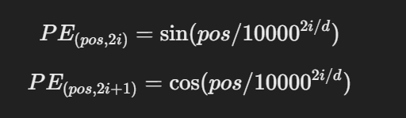

# [LLM] 4. LLM이 이해하는 text
---

## 📝 토큰화 (Tokenization)
---

LLM이 text를 이해할 수 있도록 작은 단위로 쪼개는 과정이 필요합니다. 이 과정을 토큰화라고 합니다. LLM은 문자를 이해할 수 없기 때문에 숫자로 변환해 줘야하는데 그 과정을 하기 전에 토큰화를 먼저 합니다.

### ✅ 토큰화 기법 종류

| 토큰화 방식 | 설명 | 장점 | 단점 |
|------------|------|------|------|
| **Word-level Tokenization** | 단어 단위로 쪼갬 (예: "I love NLP" → ["I", "love", "NLP"]) | 쉬움, 빠름 | 희귀 단어(Out-of-Vocabulary, OOV) 처리 어려움 |
| **Subword Tokenization (BPE, WordPiece)** | 단어를 더 작은 서브워드로 쪼갬 (예: "unhappiness" → ["un", "happiness"]) | 희귀 단어 대응 가능 | 구현이 복잡함 |
| **Character-level Tokenization** | 글자 하나하나를 토큰으로 사용 (예: "hello" → ["h", "e", "l", "l", "o"]) | OOV 문제 없음 | 문맥 이해 어려움, 시퀀스 길어짐 |


## 📝 BPE (Byte Pair Encoding)란?
---

BPE는 가장 널리 쓰이는 토큰화 방식 중 하나입니다.  
기본 원리는 가장 많이 등장하는 문자 쌍을 병합하여 서브워드 단위의 사전을 만드는 것입니다.  
처음에는 개별 문자 단위로 시작해서 점점 더 긴 서브워드 토큰을 추가하여 단어를 생성해나가는 방식입니다.

### ✅ 작동원리

1. 한글자씩 토큰화

```text
"hello" → ["h", "e", "l", "l", "o"]
```


2. 가장 많이 등장하는 문자쌍을 병합

```text
"l"과 "l"이 가장 많이 등장 → ["h", "e", "ll", "o"]
```

3. 빈도 높은 쌍을 병합

```text
"ll"과 "o" → ["h", "e", "llo"]
```

4. 최종적으로 단어 완성

```text
"hello" → ["hello"]
```

:::info 장점
- 희귀 단어 처리 가능 > 처음보는 단어도 서브워드 조합으로 표현할 수 있습니다.
- 어휘 크기 감소 > 전체 단어를 저장할 필요가 없습니다.
- 일반적인 자연어 처리에 적합하다.
:::


## 📝 Token ID 변환
---

토큰화된 단어를 LLM이 이해할 수 있도록 숫자로 변환해야합니다. 이를 Token ID Mapping이라고 합니다.


### ✅ 예시

```text
"Hello, world!" → ["Hello", ",", "world", "!"]
```

위와 같은 input text가 들어온다면 모델은 vocabulary를 이용하여 각 토큰에 고유한 ID를 할당하여 아래처럼 표현합니다.

```text
"Hello" → 12345
"," → 5
"world" → 67890
"!" → 8
```

그래서 다음처럼 변환하여 모델이 이해할 수 있도록 합니다.

```text
[12345, 5, 67890, 8]
```


## 📝 슬라이딩 윈도우 (Sliding Window)
---

LLM은 한번에 처리할 수 있는 text 길이가 제한되어 있습니다. GPT-2같은 경우에는 1024가 최대 토큰 길이라고 하네요.
그러나 긴 문장을 처리해야할 때가 있습니다. 이 때 슬라이딩 윈도우 방식을 사용하여 해결합니다.

### ✅ 방식

- 전체 문장을 일정한 길이만큼 잘라서 훈련 데이터로 사용(chunking 하는 것 같네) > 한 번에 일정한 개수의 단어만 학습하고 다음 훈련 샘플에서 일부 겹치게 잘라서 사용
- RAG에서 임베딩하는 방식과 유사하다. 어쩌면 RAG 임베딩하는 방식이 이 방식을 따랐나보다. 어쩌면 RAG는 실시간 파인 튜닝이 아닐까?

### ✅ 예제

```text
input text: "I love learning about AI and NLP models."
```

위 문장을 `Window size` = 5 `Stride` = 3으로 처리한다면

```text
window 1: ["I", "love", "learning", "about", "AI"]
window 2: ["learning", "about", "AI", "and", "NLP"]
window 3: ["AI", "and", "NLP", "models", "."]
```

위처럼 나옵니다.


- `Windows Size`는 한 윈도우에 저장할 토큰 수이고 `Stride`는 윈도우가 겹치는 정도를 조절할 수 있습니다.
- `Stride=2`라고 한다면 각 윈도우들이 두 토큰 씩 이동하여 겹치게 되는 겁니다. 예를 들어서 첫 번째 윈도우가 `[토큰1, 토큰2, 토큰3, 토큰4, 토큰5]`를 포함한다면, 두 번째 윈도우는 `[토큰3, 토큰4, 토큰5, 토큰6, 토큰7]`을 포함하게 됩니다. 

:::info 장점
- 긴 문장도 작은 조각으로 나눠서 전부 학습을 시킬 수 있습니다.
- 연속된 문맥을 유지할 수 있습니다.
- GPU 메모리를 절약할 수 있습니다.
:::

## 📝 위치 인코딩 (Position Encoding)
---

모델은 단어의 순서를 자연스럽게 이해하기를 어려워합니다. 그래서 이를 해결하기 위해서 위치 인코딩을 추가해줘야 합니다. 단어의 위치 정보를 숫자로 변환하여 모델에 입력하는 것이 위치 인코딩입니다.

```text
["I", "love", "AI"]
["AI", "love", "I"]
```

이랬던 문장을 위치 인코딩을 추가한다며

```text
["I"(0), "love"(1), "AI"(2)]
["AI"(0), "love"(1), "I"(2)]
```

이렇게 순서를 알 수 있도록 순서를 추가해주는 것입니다.

### ✅ 종류

- 🚀 **Absolute Position Encoding (고정 위치 인코딩)**
    가장 단순한 방법으로 단어의 위치를 숫자로 직접 표현하는 방법입니다.

```text
["I"(0), "love"(1), "AI"(2)]
```

:::warning 문제점
- 모델이 학습하면서 위치 정보를 효과적으로 활용하기 어려움
- 문장이 길어지면 일반화 어려움
:::

- 🚀 **Sinusoidal Position Encoding(사인 함수 기반 위치 인코딩)**
    사인(sin)과 코사인(cos) 함수를 사용해서 위치 정보를 인코딩 합니다.

> Sin, Cos 함수 사용하는 이유
>> 1. 주기적인 성질을 갖기 때문 -> 문장 길이가 변해도 패턴이 유지된다.
>> 2. 모든 문장 길이에 대해 일반화 가능 -> 학습되지 않은 긴 문장도 이해할 수 있다.
>> 3. 단어 간 상대적 거리 유지 -> 문장의 구조를 반영할 수 있다.




- `pos`는 단어의 위치 (0,1,2..) 
- `d`는 모델의 임베딩 차원 (ex: 512)
- `i`는 임베딩 차원의 인덱스

- 🚀 **Learnable Position Encoding (학습 가능한 위치 인코딩)**
    GPT 모델에서는 위치 인코딩을 학습할 수 있도록 바꿔서 사용한다고 합니다.
    방식은 다음과 같습니다.
    1. 학습 가능한 위치 임베딩 레이어를 추가.
    2. 학습 과정에서 모델이 위치 정보를 최적화
    3. 위치 정보를 고정하지 않고 문맥에 따라 유연하게 학습

