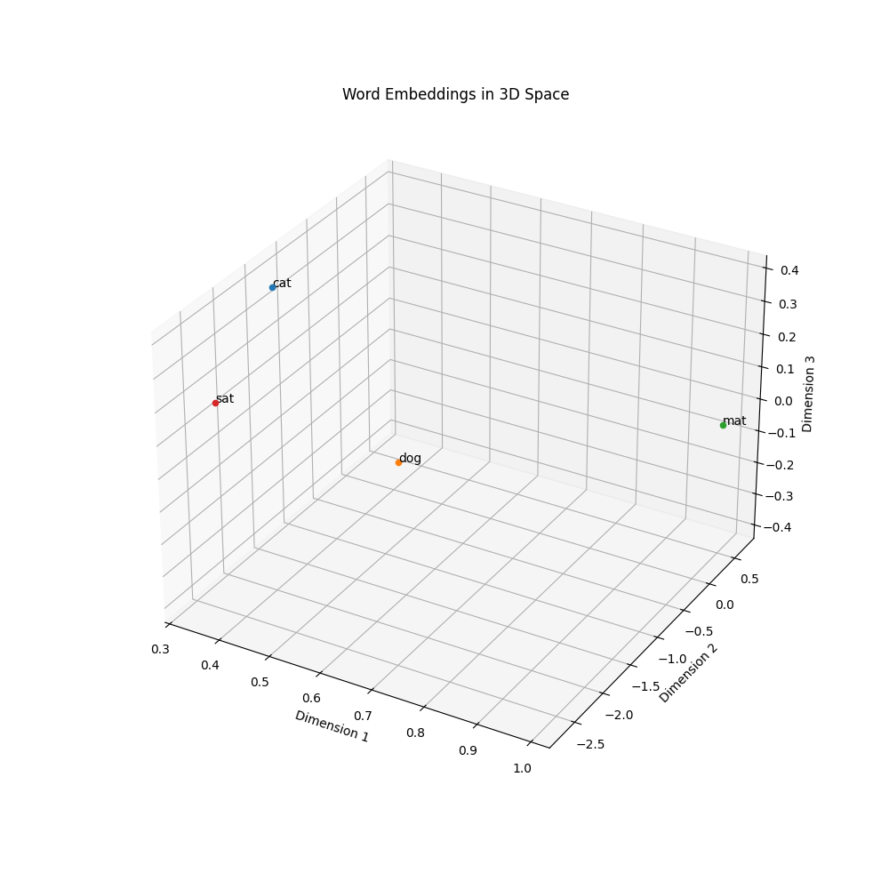

# [LLM] 8. Token Embedding
---

LLM은 Text를 숫자로 변환해줘야 학습할 수 있습니다. 이 때 단순히 단어마다 ID를 부여하면 차원이 너무 커집니다. 그래서 Embedding을 이용하여 차원을 축소하고 의미를 보존하여 효율적인 학습을 추구합니다.

## 실습

### 임베딩 값 확인

```python
import torch 
import torch.nn as nn 

word_to_index = {"cat": 0, "dog": 1, "mat": 2, "sat": 3} 
vocab_size = len(word_to_index)
embedding_dim = 3

embedding_layer = nn.Embedding(vocab_size, embedding_dim) 

# 각 단어별로 임베딩 벡터 확인
for word in ["cat", "dog", "mat", "sat"]:
    index = torch.tensor([word_to_index[word]])
    vector = embedding_layer(index)
    print(f"{word}의 임베딩 벡터: {vector.squeeze()}")
```

```text
cat의 임베딩 벡터: tensor([-0.1789, -1.1320,  0.7210], grad_fn=<SqueezeBackward0>)
dog의 임베딩 벡터: tensor([0.4850, 0.2686, 1.2284], grad_fn=<SqueezeBackward0>)
mat의 임베딩 벡터: tensor([ 1.5514,  0.1519, -0.7032], grad_fn=<SqueezeBackward0>)
sat의 임베딩 벡터: tensor([ 0.0770, -1.4069,  0.6025], grad_fn=<SqueezeBackward0>)
```

### 임베딩 값 시각화

```python
import torch 
import torch.nn as nn 
import matplotlib.pyplot as plt
from mpl_toolkits.mplot3d import Axes3D  # 3D 플로팅을 위해 필요

word_to_index = {"cat": 0, "dog": 1, "mat": 2, "sat": 3} 
vocab_size = len(word_to_index)
embedding_dim = 3

embedding_layer = nn.Embedding(vocab_size, embedding_dim) 

words = ["cat", "dog", "mat", "sat"]
word_inputs = torch.tensor([word_to_index[word] for word in words])
embedding_vectors = embedding_layer(word_inputs)

# 3D 그래프 생성
fig = plt.figure(figsize=(10, 10))
ax = fig.add_subplot(111, projection='3d')

# 벡터값 추출
vectors = embedding_vectors.detach().numpy()

# 각 단어를 3D 공간에 플로팅
for i, word in enumerate(words):
    ax.scatter(vectors[i, 0], vectors[i, 1], vectors[i, 2])
    ax.text(vectors[i, 0], vectors[i, 1], vectors[i, 2], word)

ax.set_xlabel('Dimension 1')
ax.set_ylabel('Dimension 2')
ax.set_zlabel('Dimension 3')
plt.title('Word Embeddings in 3D Space')

plt.show()
```



학습이 된 결과는 아니지만 그냥 이런식으로 임베딩이 되는구나를 알 수 있었습니다.

3차원까지만 확인했는데 다차원이라고 가정하고 상상은 해볼 수 있을 것 같습니다.