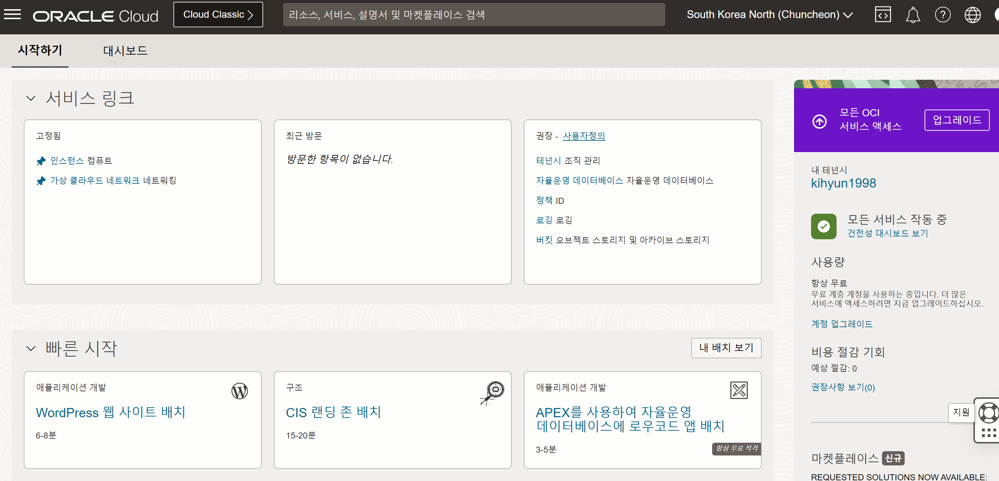
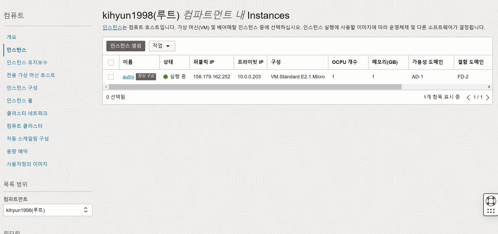
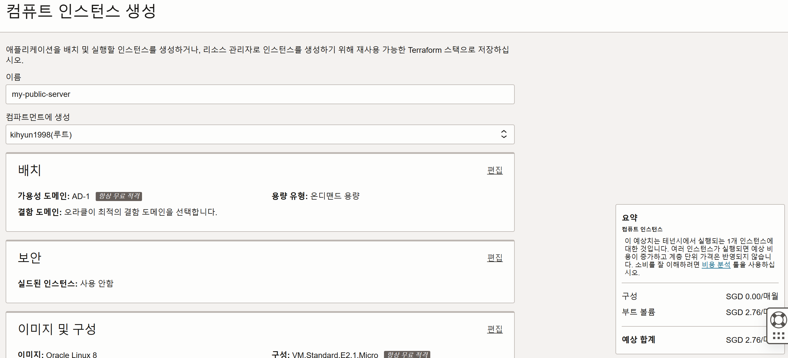
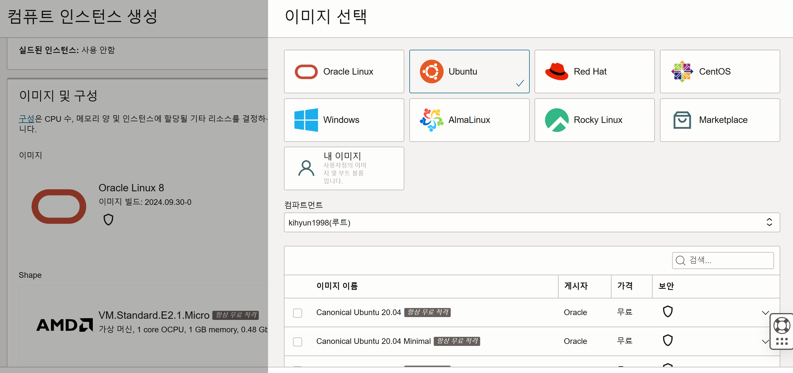
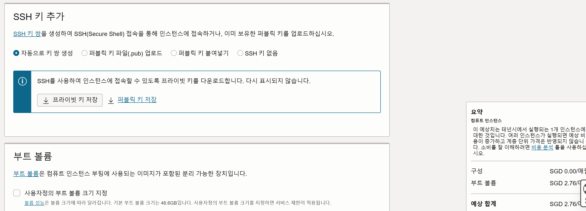
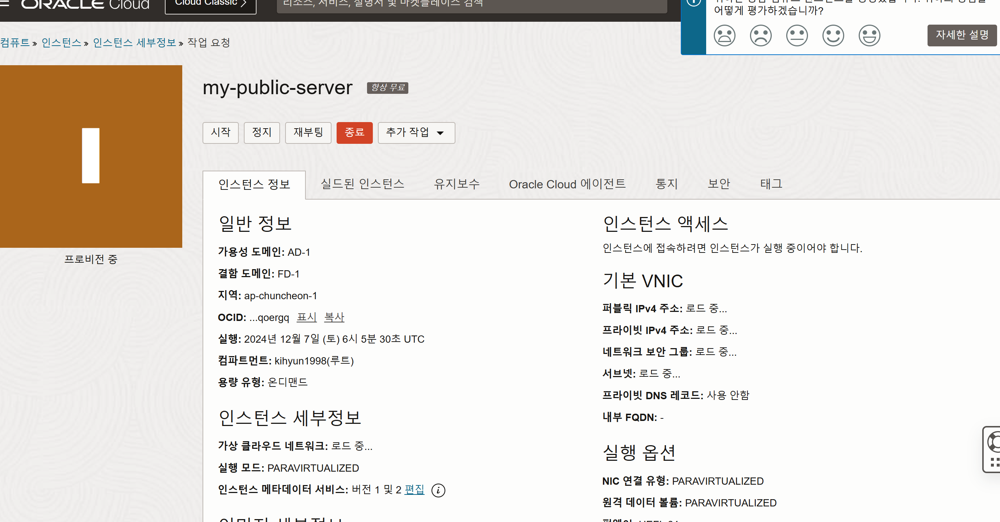

# [Oracle Cloud] 서버 이용하기
---

## 회원가입
---

Oracle Cloud 서버는 무료여서 아주 좋아요

[오라클 클라우드 링크](https://www.oracle.com/kr/cloud/)

회원가입을 진행해주시고

## 인스턴스 생성
---

로그인 하시면 아마 아래 링크같은 곳으로 들어가집니다.

[로그인 후 화면](https://cloud.oracle.com/?region=ap-chuncheon-1)

이런 화면이 나타나는 것을 알 수 있습니다.

### 인스턴스 생성

여기서 `인스턴스 컴퓨트`를 클릭한 후

`인스턴스 생성`을 클릭하셔야하는데 저는 안나옵니다. 그런경우에는 좌측 하단에 `compartment`를 자신의 아이디로 설정해줘야 합니다... ( 이거 때문에 10분을 소모했어요. )

여기서 이제 `인스턴스 생성` 클릭 (무료 플랜은 2개까지 생성할 수 있습니다.)

### 이미지 변경

들어가서 이름 작성하시고 `이미지 및 구성`에서 OS 이미지를 변경할 수 있습니다.

`편집` > `이미지 변경`을 클릭하시면 이런 화면이 나옵니다. 저는 우분투를 사용할 것입니다 !

원하는 운영체제 이미지와 빌드버전을 선택한 후 `이미지 선택`을 누르면 이미지가 변경됩니다.

### SSH Key 추가

SSH Key가 있어야 인스턴스에 로그인할 수 있습니다.

`private key`와 `public key` 모두 저장해놓습니다.

### 생성

부트 볼륨은 건너뛰고 `생성`을 누르면 생성하기 시작합니다.

이러다가 초록색으로 바뀌면 완성입니다.

키 업로드 될 때까지 기다렸다가 접속할 수 있습니다.

## 접속
---

MobaXterm으로 접속하려 합니다.

`Session` > `SSH`에서 

`Remote host`에 IP입력하고 `Specify username`에 `ubuntu`을 입력합니다.

`Advanced SSH settings`에 `Use private key` 체크하고 위에서 다운로드 했던 `private key`를 넣어두면 완료 !!

