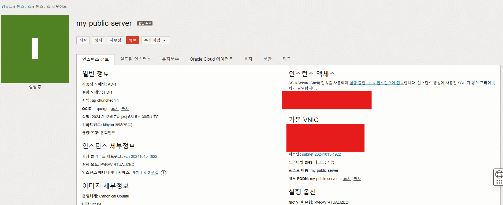
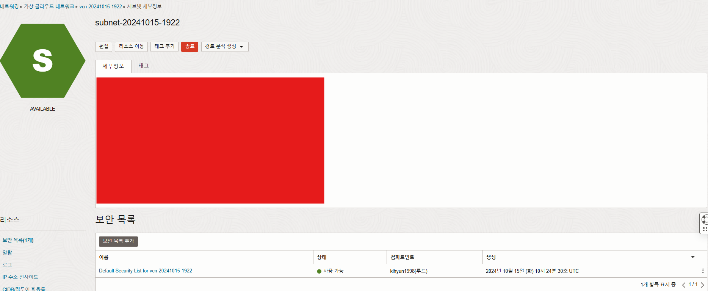
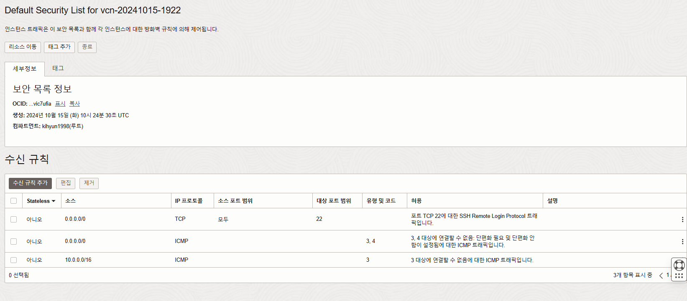
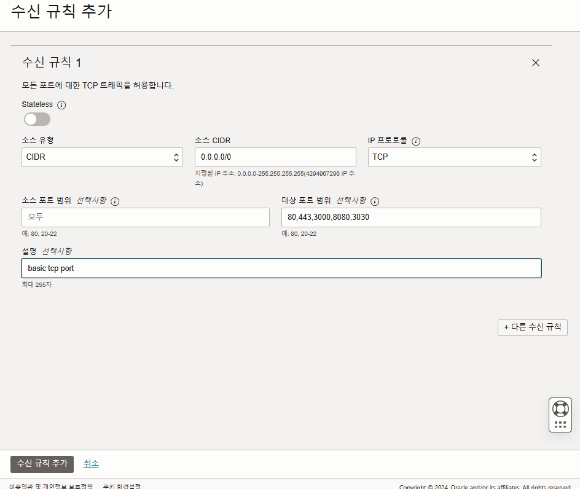

# [Oracle Cloud] 포트포워딩
---

이 상태라면 웹서버를 올려도 접속할 수 없습니다.  
보안설정이 돼있던 부분을 설정해줘야합니다.

## 보안 설정
---

### 보안 목록



이곳에서 `기본 VNIC` 밑에 `서브넷`을 클릭해서 들어가면



이렇게 나오는데 밑에 보안목록에서 보안 설정을 해줄 수 있습니다.

사용하고 있는 보안 목록들이 있을텐데 들어가서 추가적인 보안 설정을 할 수 있습니다.


### 수신 규칙추가



수신 규칙쪽을 수정하면 포트 포워딩을 할 수 있습니다.


`수신 규칙 추가` 를 클릭하셔서 필요한 추가를 할 수 있습니다.



이렇게 한다면 `0.0.0.0/0`은 모든 아이피를 들어올 수 있게 하는 것이고

`대상 포트 범위`에 작성한 포트번호만큼 open 해놓겠다는 것입니다.


### iptable 만들기

오라클 클라우드는 추가적으로 iptable이라는 것을 만들어야한다고 합니다.

```bash
sudo iptables -I INPUT 5 -i ens3 -p tcp --dport 80 -m state --state NEW,ESTABLISHED -j ACCEPT
```

이렇게 하면 80 port로 tcp가 열립니다.


```bash
ubuntu@my-public-server:~$ sudo iptables --list
Chain INPUT (policy ACCEPT)
target     prot opt source               destination
ACCEPT     all  --  anywhere             anywhere             state RELATED,ESTABLISHED
ACCEPT     icmp --  anywhere             anywhere
ACCEPT     all  --  anywhere             anywhere
ACCEPT     udp  --  anywhere             anywhere             udp spt:ntp
ACCEPT     tcp  --  anywhere             anywhere             tcp dpt:http state NEW,ESTABLISHED
ACCEPT     tcp  --  anywhere             anywhere             state NEW tcp dpt:ssh
REJECT     all  --  anywhere             anywhere             reject-with icmp-host-prohibited
...
```

`iptables --list`로 추가된걸 확인할 수 있습니다.

중간에 http state NEW,ESTABLISHED가 추가된 것을 확인할 수 있습니다.