# [Supabse] Oauth 하기
---

## Google OAuth
---

### 가입

구글 클라우드에 가입을 해야합니다. (가입하는 방법은 검색하기)

[구글 클라우드드](https://cloud.google.com/?hl=ko)

### 콘솔로 이동

콘솔로 들어옵니다.

[구글 클라우드 콘솔](https://console.cloud.google.com/welcome?hl=ko)


### 새 프로젝트 생성

새 프로젝트를 만들어줍니다.

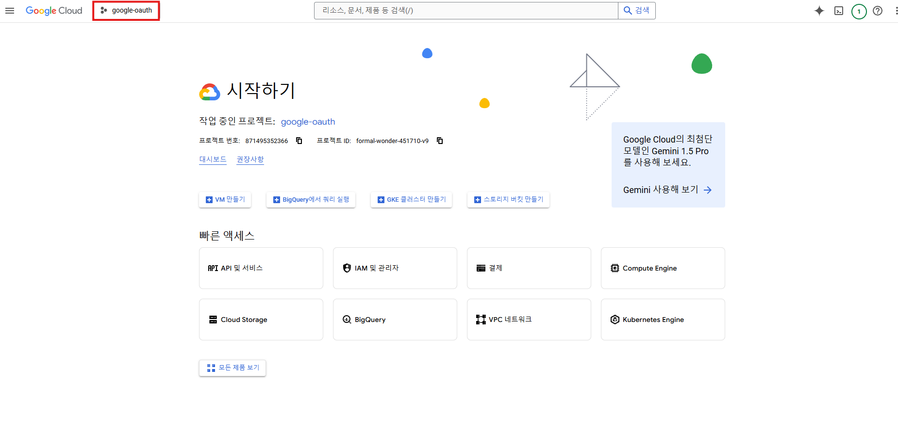

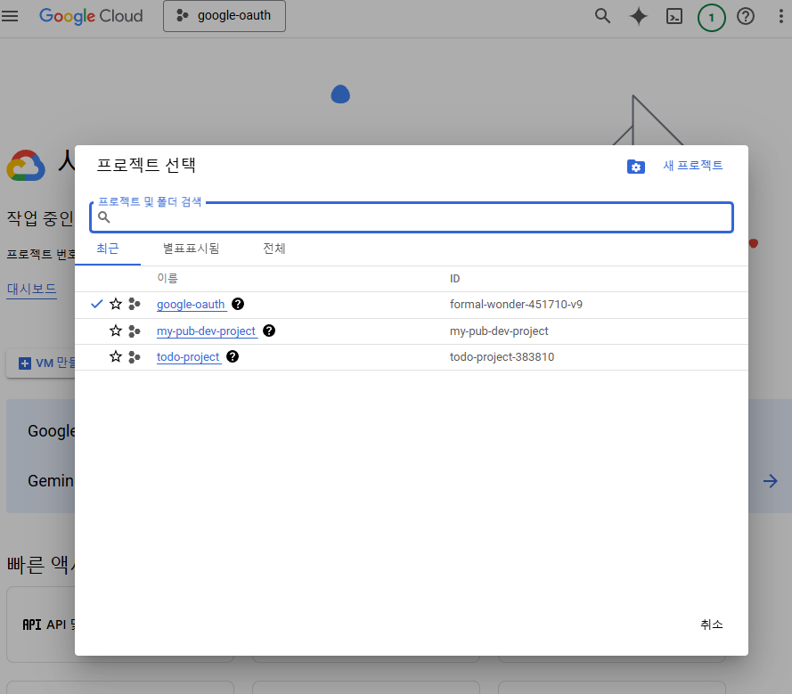


### OAuth 동의 화면 만들기

OAuth 동의 화면 눌러서 이동합니다.

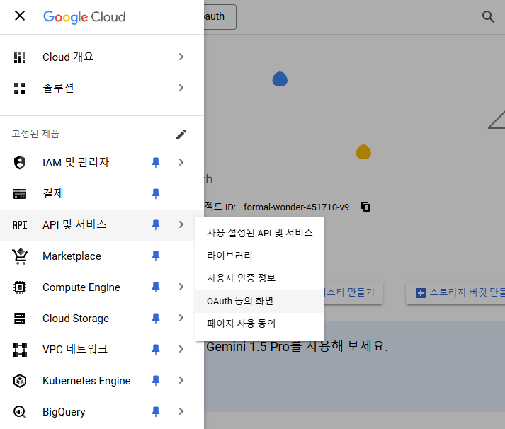

시작하기를 눌러서 만들 수 있습니다.

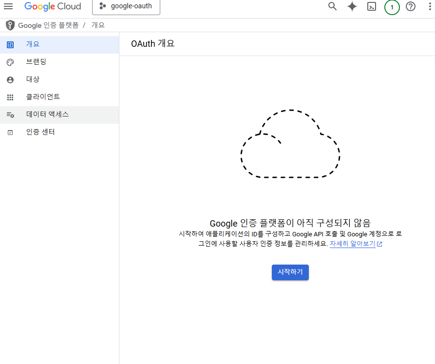


적당한 앱정보를 입력하고

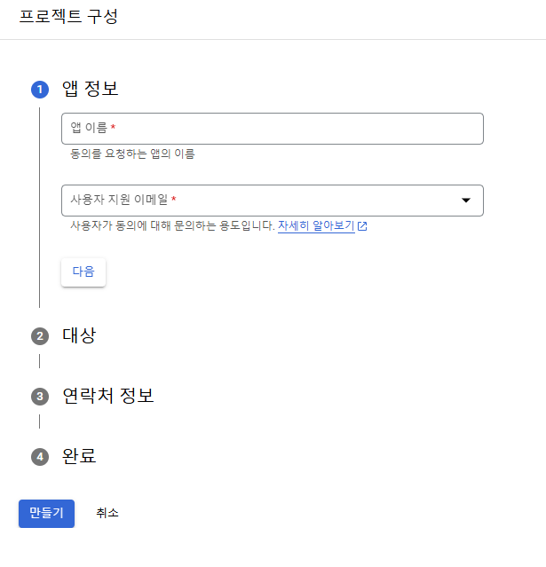

외부를 체크

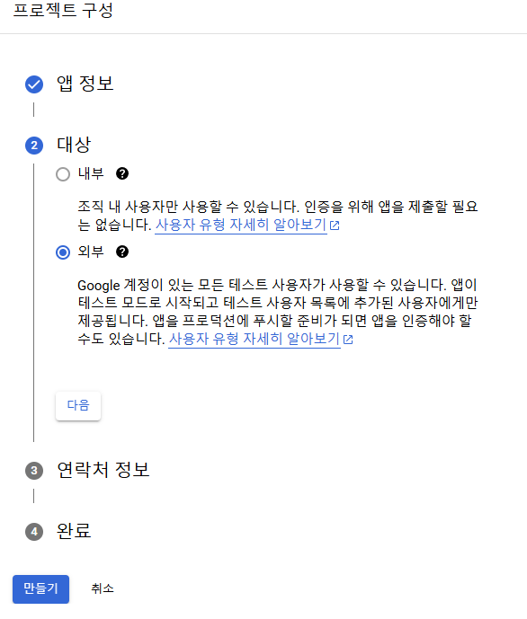

나머지는 알아서 하실 수 있습니다 ! `만들기` 버튼을 누르면 만들어지는데요.

### 범위 적용

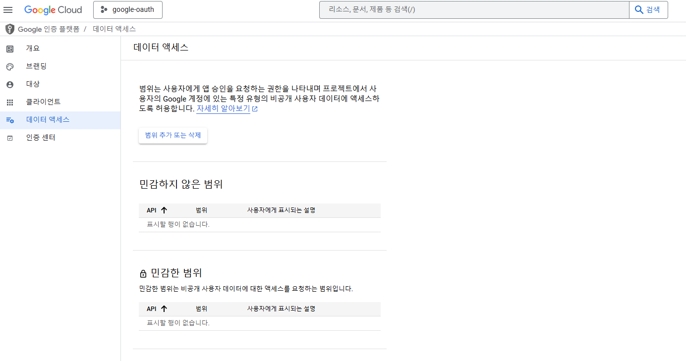

범위 설정을 해야합니다. `범위 추가 또는 삭제`를 클릭해서

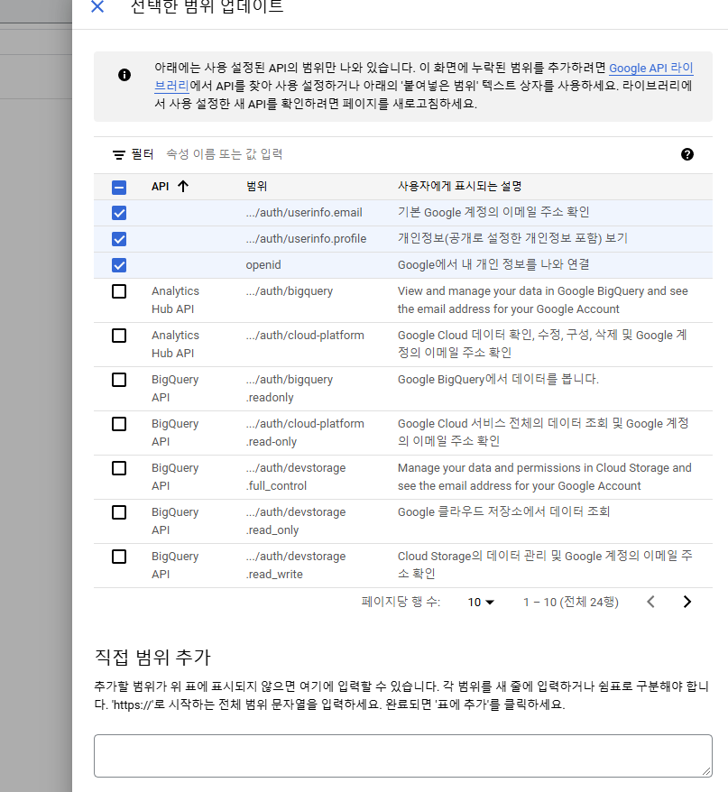

이 3가지를 꼭 지정해야한다고 하네요. 체크 후 `업데이트` 클릭


### OAuth 클라이언트(Web Application) 만들기

(내용을 빠뜨린게 있어서 추가합니다..)

이거를 먼저 진행해줘야해요. 저희 Flutter Android 앱을 위한 Oauth 구축 맞습니다. 근데 Web application 먼저 해줘야해요.


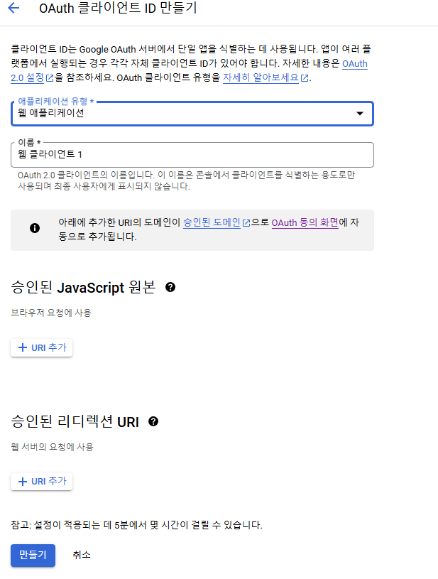

여기서 `승인된 리디렉션 URI`의 `URL 추가`를 눌러줍니다. Supabase에서 제공하는 Callback URL을 넣어줘야하는데 아래처럼 이동합니다.


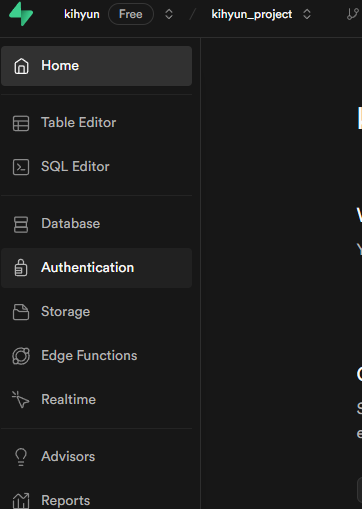

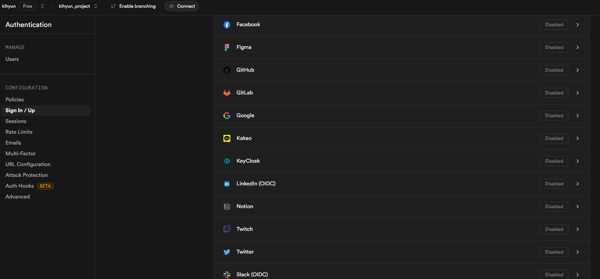

Supabase dashbord에서 `Authentication`(자물쇠 모양) 클릭 후 `Sign/In Up` > `Google` 클릭하면 나오는 곳에서

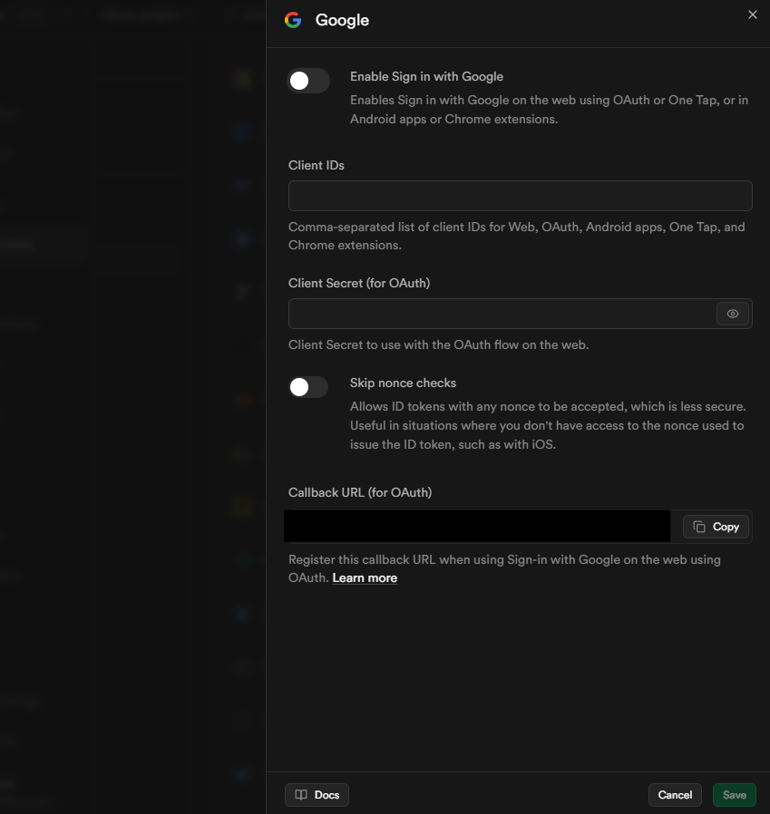

`Callback URL` 부분을 복사해서 넣습니다.


그래가지구 만들어진 WebApplication의 client ID와 Secret ID가 있을텐데 알맞는 곳에 넣습니다..


### OAuth 클라이언트(Android) 만들기

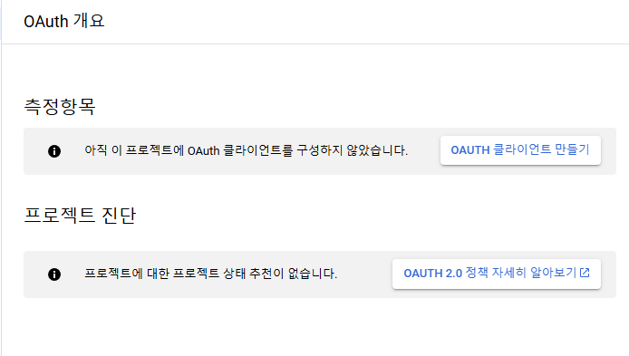

이런 화면이 나올텐데 `OAUTH 클라이언트 만들기` 를 클릭해서

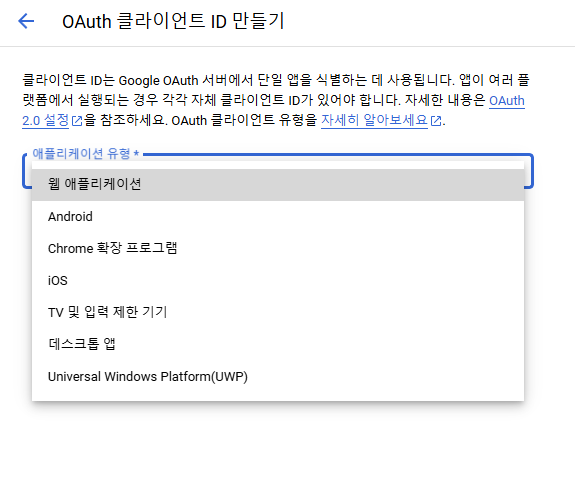

원하는 앱으로 만들면 됩니다. 저는 안드로이드로 해볼게요.

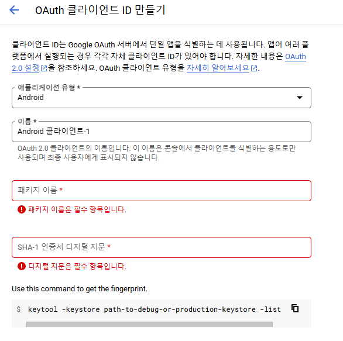

여기서부터 겁나 어렵네요..

일단 이름은 아무거나 하고. `패키지이름`은 Flutter 기준 `/android/app/build.gradle` 파일에서 `namespace` 또는 `applicationId`에 할당 돼있는 값이 패키지이름 입니다 ! 보통 com.example.. 이런식일거에요.


SHA-1 인증서 디지털 지문은 아래 명령어로 얻을 수 있습니다.

```bash
cd android
./gradlew signingReport
```

나온 값 중 아무거나 `SHA-1` 사용하면 됩니다. 다 똑같을거에요..

아니면 구글에서 추천해준대로 저걸 사용하면 되는데

```bash
cd ~\.android
keytool -list -v -keystore debug.keystore
```

이렇게 할수도 있습니다. 비밀번호는 `android`를 입력하시면 됩니다.

그리고 만들기 클릭 !!!


클라이언트 ID를 복사합니다.


### supabase 적용


Supabase dashbord에서 `Authentication`(자물쇠 모양) 클릭 후 `Sign/In Up` > `Google` 클릭하면 나올텐데.

여기서 Client IDs에 웹 어플리케이션에 대한 Client ID가 들어가 있을텐데 맨 뒤에 `,`를 붙이고 Android에 대한 Client ID를 추가하시면 됩니다. 

### IOS도 하고싶다면?

만약 IOS도 추가하고 싶다면.. 똑같이 ClientID 맨뒤에 `,`를 붙이고 한 후에.. 여기가 중요한데 `Skip nonce checks`를 꼭 활성화 시켜줘야합니다.


이러면 이제 개발에 들어갈 수 있습니다.